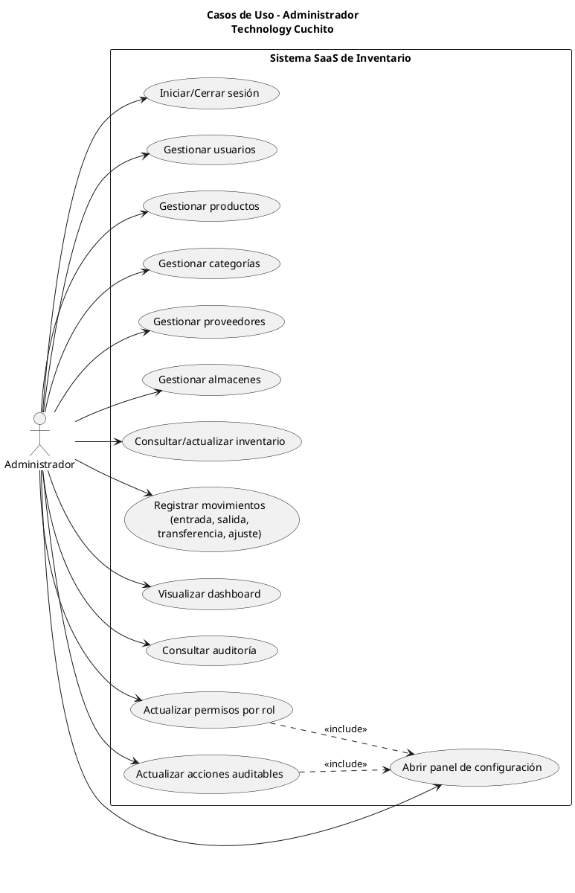

# Diagrama de Casos de Uso - Administrador

## PlantUML

## Notas

- El rol administrador tiene acceso completo a todos los endpoints de negocio.
- El panel de configuración persiste cambios de permisos/acciones auditables en `admin-settings.json`.
- Toda acción crítica genera registro en `auditoria`.

