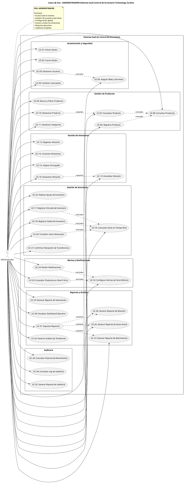

# Diagrama de Casos de Uso - ADMINISTRADOR
## Sistema SaaS de Control de Inventario - Technology Cuchito

---

## Diagrama UML - PlantUML

---

## ESPECIFICACIONES DE CASOS DE USO

---

### MÓDULO: AUTENTICACIÓN Y SEGURIDAD

#### UC-01: Iniciar Sesión

**ID del Caso de Uso:** UC-01  
**Nombre del Caso de Uso:** Iniciar Sesión  
**Actor Principal:** Administrador  

**Descripción:**  
Permite al administrador autenticarse en el sistema mediante credenciales (usuario y contraseña) para acceder a todas las funcionalidades del sistema.

**Precondiciones:**  
- El administrador debe estar registrado en el sistema
- El sistema debe estar operativo
- El usuario no debe tener sesión activa

**Flujo Básico:**
1. El administrador accede a la página de login
2. El sistema muestra el formulario de autenticación
3. El administrador ingresa su usuario y contraseña
4. El administrador presiona el botón "Iniciar Sesión"
5. El sistema valida las credenciales
6. El sistema genera un token JWT
7. El sistema redirige al dashboard principal con permisos de administrador
8. El caso de uso finaliza

**Flujo Alternativo:**
- **FA-01 (Credenciales incorrectas):**
  - En el paso 5, si las credenciales son incorrectas:
    - El sistema muestra mensaje de error "Usuario o contraseña incorrectos"
    - El sistema mantiene al usuario en la página de login
    - Retorna al paso 2

- **FA-02 (Usuario bloqueado):**
  - En el paso 5, si el usuario está bloqueado:
    - El sistema muestra mensaje "Usuario bloqueado. Contacte al administrador"
    - El sistema no permite el acceso
    - El caso de uso finaliza

- **FA-03 (Sesión ya activa):**
  - En el paso 1, si el usuario ya tiene sesión activa:
    - El sistema redirige automáticamente al dashboard
    - El caso de uso finaliza

**Postcondiciones:**
- El administrador queda autenticado en el sistema
- Se genera un token de sesión válido
- Se registra el inicio de sesión en el log de auditoría
- El administrador tiene acceso a todos los módulos del sistema

---

#### UC-02: Cerrar Sesión

**ID del Caso de Uso:** UC-02  
**Nombre del Caso de Uso:** Cerrar Sesión  
**Actor Principal:** Administrador  

**Descripción:**  
Permite al administrador cerrar su sesión actual en el sistema de forma segura.

**Precondiciones:**  
- El administrador debe tener una sesión activa
- El administrador debe estar autenticado

**Flujo Básico:**
1. El administrador selecciona la opción "Cerrar Sesión"
2. El sistema muestra mensaje de confirmación
3. El administrador confirma el cierre de sesión
4. El sistema invalida el token JWT
5. El sistema limpia los datos de sesión
6. El sistema redirige a la página de login
7. El caso de uso finaliza

**Flujo Alternativo:**
- **FA-01 (Cancelar cierre de sesión):**
  - En el paso 3, si el administrador cancela:
    - El sistema mantiene la sesión activa
    - El sistema permanece en la página actual
    - El caso de uso finaliza

- **FA-02 (Sesión expirada):**
  - Si la sesión ya expiró:
    - El sistema redirige automáticamente al login
    - El sistema muestra mensaje "Sesión expirada"
    - El caso de uso finaliza

**Postcondiciones:**
- La sesión del administrador queda cerrada
- El token de autenticación queda invalidado
- Se registra el cierre de sesión en el log de auditoría
- El usuario debe autenticarse nuevamente para acceder

---

#### UC-03: Gestionar Usuarios

**ID del Caso de Uso:** UC-03  
**Nombre del Caso de Uso:** Gestionar Usuarios  
**Actor Principal:** Administrador  

**Descripción:**  
Permite al administrador crear, modificar, consultar y desactivar usuarios del sistema.

**Precondiciones:**  
- El administrador debe estar autenticado
- El administrador debe tener permisos de gestión de usuarios

**Flujo Básico:**
1. El administrador accede al módulo de Usuarios
2. El sistema muestra el listado de usuarios registrados
3. El administrador selecciona la acción deseada (Crear, Editar, Ver, Desactivar)
4. El sistema muestra el formulario correspondiente
5. El administrador ingresa/modifica la información requerida (nombre, email, rol, almacén asignado)
6. El administrador presiona "Guardar"
7. El sistema valida los datos ingresados
8. El sistema ejecuta la acción de asignación de roles (incluye UC-04)
9. El sistema guarda los cambios en la base de datos
10. El sistema muestra mensaje de confirmación
11. El sistema actualiza el listado de usuarios
12. El caso de uso finaliza

**Flujo Alternativo:**
- **FA-01 (Datos inválidos):**
  - En el paso 7, si los datos son inválidos:
    - El sistema muestra mensajes de error específicos
    - El sistema mantiene el formulario abierto
    - Retorna al paso 5

- **FA-02 (Email duplicado):**
  - En el paso 7, si el email ya existe:
    - El sistema muestra "El email ya está registrado"
    - Retorna al paso 5

- **FA-03 (Cancelar operación):**
  - En cualquier paso, si el administrador cancela:
    - El sistema descarta los cambios
    - Retorna al paso 2

- **FA-04 (Buscar usuario):**
  - En el paso 2, el administrador puede buscar usuarios
    - El sistema filtra el listado según criterios
    - Muestra resultados filtrados
    - Continúa en paso 3

**Postcondiciones:**
- El usuario queda registrado/modificado/desactivado en el sistema
- Se asignan roles y permisos correspondientes
- Se registra la operación en el log de auditoría
- El listado de usuarios se actualiza

---

#### UC-04: Asignar Roles y Permisos

**ID del Caso de Uso:** UC-04  
**Nombre del Caso de Uso:** Asignar Roles y Permisos  
**Actor Principal:** Administrador  

**Descripción:**  
Permite al administrador asignar roles específicos (Administrador, Encargado de Almacén, Usuario Operativo) y sus permisos asociados a los usuarios del sistema.

**Precondiciones:**  
- El administrador debe estar autenticado
- El usuario a asignar debe existir en el sistema
- Se está ejecutando desde UC-03 (Gestionar Usuarios)

**Flujo Básico:**
1. El sistema muestra el formulario de usuario con sección de roles
2. El administrador selecciona el rol del desplegable (Administrador, Encargado, Operativo)
3. Si es Encargado de Almacén, el sistema muestra campo de almacén asignado
4. El administrador selecciona el almacén correspondiente (si aplica)
5. El sistema muestra los permisos asociados al rol seleccionado
6. El administrador confirma la asignación
7. El sistema valida que la asignación sea válida
8. El sistema guarda el rol y permisos en la base de datos
9. El sistema muestra mensaje "Rol asignado correctamente"
10. El caso de uso finaliza

**Flujo Alternativo:**
- **FA-01 (Cambiar rol de usuario activo):**
  - Si el usuario tiene sesión activa:
    - El sistema muestra advertencia "El usuario tiene sesión activa"
    - El administrador confirma el cambio
    - El sistema invalida la sesión actual del usuario
    - Continúa en paso 8

- **FA-02 (Encargado sin almacén):**
  - En el paso 4, si se selecciona rol Encargado sin asignar almacén:
    - El sistema muestra error "Debe asignar un almacén"
    - Retorna al paso 4

- **FA-03 (Almacén ya tiene encargado):**
  - En el paso 7, si el almacén ya tiene encargado:
    - El sistema muestra advertencia "El almacén ya tiene encargado"
    - Ofrece opciones: reasignar o cancelar
    - Si reasigna: continúa en paso 8
    - Si cancela: retorna al paso 4

**Postcondiciones:**
- El usuario tiene el rol asignado correctamente
- Los permisos del rol están activos para el usuario
- Si es encargado, el almacén queda vinculado
- Se registra la asignación en el log de auditoría

---

#### UC-05: Cambiar Contraseña

**ID del Caso de Uso:** UC-05  
**Nombre del Caso de Uso:** Cambiar Contraseña  
**Actor Principal:** Administrador  

**Descripción:**  
Permite al administrador cambiar su propia contraseña de acceso al sistema.

**Precondiciones:**  
- El administrador debe estar autenticado
- El administrador debe conocer su contraseña actual

**Flujo Básico:**
1. El administrador accede a su perfil
2. El administrador selecciona "Cambiar Contraseña"
3. El sistema muestra formulario de cambio de contraseña
4. El administrador ingresa contraseña actual
5. El administrador ingresa nueva contraseña
6. El administrador confirma nueva contraseña
7. El administrador presiona "Guardar"
8. El sistema valida la contraseña actual
9. El sistema valida que la nueva contraseña cumpla políticas de seguridad
10. El sistema encripta la nueva contraseña
11. El sistema actualiza la contraseña en la base de datos
12. El sistema muestra mensaje "Contraseña actualizada correctamente"
13. El caso de uso finaliza

**Flujo Alternativo:**
- **FA-01 (Contraseña actual incorrecta):**
  - En el paso 8, si la contraseña actual es incorrecta:
    - El sistema muestra "Contraseña actual incorrecta"
    - Retorna al paso 4

- **FA-02 (Contraseñas no coinciden):**
  - En el paso 9, si las contraseñas nuevas no coinciden:
    - El sistema muestra "Las contraseñas no coinciden"
    - Retorna al paso 5

- **FA-03 (Contraseña débil):**
  - En el paso 9, si la contraseña no cumple políticas:
    - El sistema muestra "La contraseña debe tener mínimo 8 caracteres, mayúsculas, minúsculas y números"
    - Retorna al paso 5

- **FA-04 (Cancelar cambio):**
  - En cualquier paso, si cancela:
    - El sistema descarta cambios
    - El caso de uso finaliza

**Postcondiciones:**
- La contraseña del administrador queda actualizada
- La contraseña queda encriptada en la base de datos
- Se registra el cambio en el log de auditoría
- La sesión actual permanece activa

---

### MÓDULO: GESTIÓN DE PRODUCTOS

#### UC-06: Registrar Producto

**ID del Caso de Uso:** UC-06  
**Nombre del Caso de Uso:** Registrar Producto  
**Actor Principal:** Administrador  

**Descripción:**  
Permite al administrador registrar nuevos productos tecnológicos en el catálogo del sistema.

**Precondiciones:**  
- El administrador debe estar autenticado
- Las categorías deben estar configuradas en el sistema
- Los proveedores deben estar registrados

**Flujo Básico:**
1. El administrador accede al módulo de Productos
2. El administrador selecciona "Nuevo Producto"
3. El sistema muestra el formulario de registro
4. El administrador ingresa los datos del producto:
   - Código/SKU (único)
   - Nombre del producto
   - Descripción
   - Categoría (desplegable)
   - Marca
   - Modelo
   - Proveedor principal
   - Precio de compra
   - Precio de venta
   - Stock mínimo
   - Stock máximo
   - Imagen (opcional)
5. El administrador presiona "Guardar"
6. El sistema valida que todos los campos requeridos estén completos
7. El sistema valida que el código SKU sea único
8. El sistema consulta si el producto existe (incluye UC-08)
9. El sistema guarda el producto en la base de datos
10. El sistema muestra mensaje "Producto registrado correctamente"
11. El sistema redirige al listado de productos
12. El caso de uso finaliza

**Flujo Alternativo:**
- **FA-01 (Código duplicado):**
  - En el paso 7, si el código ya existe:
    - El sistema muestra "El código SKU ya está registrado"
    - El sistema sugiere un código alternativo
    - Retorna al paso 4

- **FA-02 (Datos incompletos):**
  - En el paso 6, si faltan campos obligatorios:
    - El sistema resalta campos faltantes
    - El sistema muestra mensajes de validación
    - Retorna al paso 4

- **FA-03 (Precio inválido):**
  - En el paso 6, si precio de venta < precio de compra:
    - El sistema muestra advertencia "Precio de venta menor al costo"
    - El administrador puede confirmar o corregir
    - Si confirma: continúa en paso 8
    - Si corrige: retorna al paso 4

- **FA-04 (Agregar nueva categoría):**
  - En el paso 4, si la categoría no existe:
    - El administrador puede crear nueva categoría
    - Se ejecuta UC-11 (Gestionar Categorías)
    - Retorna al paso 4 con nueva categoría disponible

- **FA-05 (Cancelar registro):**
  - En cualquier paso, si cancela:
    - El sistema descarta datos ingresados
    - Retorna al listado de productos
    - El caso de uso finaliza

**Postcondiciones:**
- El producto queda registrado en el catálogo
- El producto está disponible para operaciones de inventario
- Se registra la operación en el log de auditoría
- El producto aparece en el listado con stock inicial en 0

---

#### UC-07: Actualizar Producto

**ID del Caso de Uso:** UC-07  
**Nombre del Caso de Uso:** Actualizar Producto  
**Actor Principal:** Administrador  

**Descripción:**  
Permite al administrador modificar la información de productos existentes en el catálogo.

**Precondiciones:**  
- El administrador debe estar autenticado
- El producto debe existir en el sistema
- El producto no debe estar en proceso de transferencia

**Flujo Básico:**
1. El administrador accede al módulo de Productos
2. El sistema muestra el listado de productos
3. El administrador busca el producto a actualizar
4. El administrador selecciona el producto
5. El sistema consulta y carga los datos del producto (incluye UC-08)
6. El sistema muestra el formulario con datos actuales
7. El administrador modifica los campos deseados
8. El administrador presiona "Guardar"
9. El sistema valida los datos modificados
10. El sistema verifica que el código SKU siga siendo único (si se modificó)
11. El sistema actualiza el producto en la base de datos
12. El sistema muestra mensaje "Producto actualizado correctamente"
13. El sistema retorna al listado actualizado
14. El caso de uso finaliza

**Flujo Alternativo:**
- **FA-01 (Producto con movimientos recientes):**
  - En el paso 5, si el producto tiene movimientos del día:
    - El sistema muestra advertencia "El producto tiene movimientos recientes"
    - El administrador confirma la actualización
    - Continúa en paso 6

- **FA-02 (Cambio de precio afecta valorización):**
  - En el paso 9, si se cambia precio de compra:
    - El sistema calcula impacto en valorización de inventario
    - El sistema muestra el impacto calculado
    - El administrador confirma o cancela
    - Si confirma: continúa en paso 11
    - Si cancela: retorna al paso 7

- **FA-03 (Producto no encontrado):**
  - En el paso 4, si el producto fue eliminado:
    - El sistema muestra "Producto no encontrado"
    - Retorna al paso 2

- **FA-04 (Modificar stock mínimo con stock actual bajo):**
  - En el paso 9, si nuevo stock mínimo > stock actual:
    - El sistema muestra advertencia "Stock actual por debajo del nuevo mínimo"
    - El sistema ofrece generar alerta
    - Continúa en paso 11

**Postcondiciones:**
- Los datos del producto quedan actualizados
- Los cambios se reflejan en todos los módulos
- Se registra la modificación en el log de auditoría
- Si cambian precios, se recalculan valorizaciones

---

#### UC-08: Consultar Productos

**ID del Caso de Uso:** UC-08  
**Nombre del Caso de Uso:** Consultar Productos  
**Actor Principal:** Administrador  

**Descripción:**  
Permite al administrador visualizar la información detallada de los productos registrados en el sistema.

**Precondiciones:**  
- El administrador debe estar autenticado
- Debe haber productos registrados en el sistema

**Flujo Básico:**
1. El administrador accede al módulo de Productos
2. El sistema muestra el listado paginado de productos con información básica:
   - Código SKU
   - Nombre
   - Categoría
   - Stock total
   - Precio
   - Estado (activo/inactivo)
3. El administrador selecciona un producto para ver detalles
4. El sistema muestra vista detallada con:
   - Información general del producto
   - Stock por almacén
   - Últimos movimientos
   - Gráfico de rotación
   - Proveedores
5. El caso de uso finaliza

**Flujo Alternativo:**
- **FA-01 (Sin productos registrados):**
  - En el paso 2, si no hay productos:
    - El sistema muestra mensaje "No hay productos registrados"
    - El sistema ofrece botón "Registrar Producto"
    - El caso de uso finaliza

- **FA-02 (Producto inactivo):**
  - En el paso 4, si el producto está inactivo:
    - El sistema muestra badge "INACTIVO"
    - El sistema muestra fecha de desactivación
    - Continúa mostrando información

- **FA-03 (Error al cargar datos):**
  - En el paso 4, si hay error al cargar:
    - El sistema muestra mensaje de error
    - El sistema ofrece recargar
    - Retorna al paso 2

**Postcondiciones:**
- El administrador visualiza la información del producto
- No se modifica ningún dato
- Se registra la consulta en el log de actividad

---

#### UC-09: Buscar y Filtrar Productos

**ID del Caso de Uso:** UC-09  
**Nombre del Caso de Uso:** Buscar y Filtrar Productos  
**Actor Principal:** Administrador  

**Descripción:**  
Permite al administrador buscar productos específicos y aplicar filtros para localizar productos según diversos criterios.

**Precondiciones:**  
- El administrador debe estar autenticado
- El administrador debe estar en el módulo de Productos

**Flujo Básico:**
1. El administrador está en el listado de productos
2. El administrador ingresa término de búsqueda en el campo de búsqueda
3. El sistema busca en tiempo real en:
   - Código SKU
   - Nombre del producto
   - Descripción
   - Marca
   - Modelo
4. El sistema muestra resultados que coinciden con el término
5. El administrador aplica filtros adicionales:
   - Por categoría
   - Por proveedor
   - Por rango de precio
   - Por nivel de stock (bajo, normal, alto)
   - Por estado (activo/inactivo)
6. El sistema aplica los filtros seleccionados
7. El sistema muestra productos filtrados
8. El sistema indica cantidad de resultados encontrados
9. El caso de uso finaliza

**Flujo Alternativo:**
- **FA-01 (Sin resultados):**
  - En el paso 4 o 7, si no hay coincidencias:
    - El sistema muestra "No se encontraron productos"
    - El sistema sugiere ajustar criterios de búsqueda
    - Permite limpiar filtros
    - El caso de uso finaliza

- **FA-02 (Limpiar búsqueda):**
  - En cualquier paso, si limpia búsqueda:
    - El sistema remueve filtros
    - El sistema muestra listado completo
    - Retorna al paso 2

- **FA-03 (Guardar filtros):**
  - En el paso 7, el administrador puede guardar combinación de filtros:
    - El sistema guarda preferencia de filtros
    - El filtro queda disponible para uso rápido
    - Continúa en paso 7

- **FA-04 (Exportar resultados):**
  - En el paso 8, el administrador puede exportar resultados:
    - El sistema genera archivo con productos filtrados
    - Se ejecuta UC-31 (Exportar Reportes)
    - El caso de uso finaliza

**Postcondiciones:**
- Se muestran los productos que cumplen criterios de búsqueda
- Los filtros permanecen activos durante la sesión
- Se registra la búsqueda en analytics del sistema

---

#### UC-10: Desactivar Producto

**ID del Caso de Uso:** UC-10  
**Nombre del Caso de Uso:** Desactivar Producto  
**Actor Principal:** Administrador  

**Descripción:**  
Permite al administrador desactivar productos que ya no se comercializan, manteniendo el historial de movimientos.

**Precondiciones:**  
- El administrador debe estar autenticado
- El producto debe existir y estar activo
- El producto no debe tener stock pendiente en almacenes

**Flujo Básico:**
1. El administrador está en la vista de actualización de producto (UC-07)
2. El administrador selecciona "Desactivar Producto"
3. El sistema verifica stock en todos los almacenes
4. El sistema muestra mensaje de confirmación
5. El administrador ingresa motivo de desactivación
6. El administrador confirma la desactivación
7. El sistema marca el producto como inactivo
8. El sistema registra fecha y motivo de desactivación
9. El sistema muestra mensaje "Producto desactivado correctamente"
10. El sistema retorna al listado de productos
11. El caso de uso finaliza

**Flujo Alternativo:**
- **FA-01 (Producto con stock):**
  - En el paso 3, si el producto tiene stock:
    - El sistema muestra "El producto tiene stock en almacenes"
    - El sistema lista almacenes con stock
    - El sistema requiere que se realice salida de stock primero
    - El caso de uso finaliza

- **FA-02 (Producto con transferencias pendientes):**
  - En el paso 3, si hay transferencias pendientes:
    - El sistema muestra "Hay transferencias pendientes de este producto"
    - El sistema no permite desactivación
    - El caso de uso finaliza

- **FA-03 (Cancelar desactivación):**
  - En el paso 6, si cancela:
    - El sistema descarta la desactivación
    - Retorna a UC-07
    - El caso de uso finaliza

- **FA-04 (Reactivar producto):**
  - Si el producto ya está inactivo:
    - El sistema muestra botón "Reactivar Producto"
    - El administrador puede reactivar
    - El sistema marca como activo
    - Se registra reactivación
    - El caso de uso finaliza

**Postcondiciones:**
- El producto queda marcado como inactivo
- El producto no aparece en operaciones nuevas
- El historial del producto se mantiene
- Se registra la desactivación en auditoría

---

#### UC-11: Gestionar Categorías

**ID del Caso de Uso:** UC-11  
**Nombre del Caso de Uso:** Gestionar Categorías  
**Actor Principal:** Administrador  

**Descripción:**  
Permite al administrador crear, modificar y eliminar categorías para clasificar los productos tecnológicos.

**Precondiciones:**  
- El administrador debe estar autenticado
- El administrador debe tener permisos de configuración

**Flujo Básico:**
1. El administrador accede al módulo de Categorías
2. El sistema muestra el listado de categorías existentes con:
   - Nombre de categoría
   - Descripción
   - Cantidad de productos asociados
   - Estado
3. El administrador selecciona acción (Crear, Editar, Eliminar)
4. El sistema muestra el formulario correspondiente
5. El administrador ingresa/modifica datos:
   - Nombre de categoría
   - Descripción
   - Icono (opcional)
   - Color de identificación
6. El administrador presiona "Guardar"
7. El sistema valida que el nombre sea único
8. El sistema guarda la categoría en la base de datos
9. El sistema muestra mensaje "Categoría guardada correctamente"
10. El sistema actualiza el listado de categorías
11. El caso de uso finaliza

**Flujo Alternativo:**
- **FA-01 (Nombre duplicado):**
  - En el paso 7, si el nombre ya existe:
    - El sistema muestra "La categoría ya existe"
    - Retorna al paso 5

- **FA-02 (Eliminar categoría con productos):**
  - En el paso 3, si se intenta eliminar categoría con productos:
    - El sistema muestra "La categoría tiene X productos asociados"
    - El sistema requiere reasignar productos a otra categoría
    - El administrador selecciona categoría destino
    - El sistema reasigna productos
    - Continúa con eliminación en paso 8

- **FA-03 (Eliminar categoría sin productos):**
  - En el paso 3, si la categoría no tiene productos:
    - El sistema solicita confirmación
    - El administrador confirma
    - El sistema elimina la categoría
    - Continúa en paso 9

- **FA-04 (Cancelar operación):**
  - En cualquier paso, si cancela:
    - El sistema descarta cambios
    - Retorna al paso 2

**Postcondiciones:**
- La categoría queda creada/modificada/eliminada
- Los productos reflejan los cambios de categorización
- Se registra la operación en auditoría
- Los filtros del sistema se actualizan

---

### MÓDULO: GESTIÓN DE ALMACENES

#### UC-12: Registrar Almacén

**ID del Caso de Uso:** UC-12  
**Nombre del Caso de Uso:** Registrar Almacén  
**Actor Principal:** Administrador  

**Descripción:**  
Permite al administrador registrar nuevos almacenes en el sistema para la gestión distribuida de inventario.

**Precondiciones:**  
- El administrador debe estar autenticado
- El administrador debe tener permisos de configuración de almacenes

**Flujo Básico:**
1. El administrador accede al módulo de Almacenes
2. El administrador selecciona "Nuevo Almacén"
3. El sistema muestra el formulario de registro
4. El administrador ingresa los datos del almacén:
   - Código de almacén (único)
   - Nombre del almacén
   - Dirección completa
   - Distrito/Ciudad
   - Teléfono de contacto
   - Capacidad total (m²)
   - Tipo (Principal, Secundario, Punto de Venta)
   - Estado (activo/inactivo)
5. El administrador presiona "Guardar"
6. El sistema valida que el código sea único
7. El sistema valida que todos los campos obligatorios estén completos
8. El sistema guarda el almacén en la base de datos
9. El sistema muestra mensaje "Almacén registrado correctamente"
10. El sistema redirige al listado de almacenes
11. El caso de uso finaliza

**Flujo Alternativo:**
- **FA-01 (Código duplicado):**
  - En el paso 6, si el código ya existe:
    - El sistema muestra "El código de almacén ya está registrado"
    - El sistema sugiere un código alternativo
    - Retorna al paso 4

- **FA-02 (Datos incompletos):**
  - En el paso 7, si faltan campos obligatorios:
    - El sistema resalta campos faltantes
    - Retorna al paso 4

- **FA-03 (Asignar encargado inmediatamente):**
  - En el paso 5, el administrador puede asignar encargado:
    - El sistema muestra lista de usuarios disponibles
    - Se ejecuta UC-15 (Asignar Encargado)
    - Continúa en paso 6

- **FA-04 (Cancelar registro):**
  - En cualquier paso, si cancela:
    - El sistema descarta datos
    - Retorna al listado de almacenes
    - El caso de uso finaliza

**Postcondiciones:**
- El almacén queda registrado en el sistema
- El almacén está disponible para operaciones de inventario
- Se registra la creación en auditoría
- El almacén aparece en todos los desplegables del sistema

---

#### UC-13: Actualizar Almacén

**ID del Caso de Uso:** UC-13  
**Nombre del Caso de Uso:** Actualizar Almacén  
**Actor Principal:** Administrador  

**Descripción:**  
Permite al administrador modificar la información de almacenes existentes.

**Precondiciones:**  
- El administrador debe estar autenticado
- El almacén debe existir en el sistema

**Flujo Básico:**
1. El administrador accede al módulo de Almacenes
2. El sistema muestra el listado de almacenes
3. El administrador selecciona el almacén a actualizar
4. El sistema carga los datos actuales del almacén
5. El sistema muestra el formulario con datos precargados
6. El administrador modifica los campos deseados
7. El administrador presiona "Guardar"
8. El sistema valida los datos modificados
9. El sistema actualiza el almacén en la base de datos
10. El sistema muestra mensaje "Almacén actualizado correctamente"
11. El sistema retorna al listado de almacenes
12. El caso de uso finaliza

**Flujo Alternativo:**
- **FA-01 (Almacén con movimientos activos):**
  - En el paso 4, si hay movimientos del día:
    - El sistema muestra advertencia
    - El administrador confirma actualización
    - Continúa en paso 5

- **FA-02 (Cambiar tipo de almacén):**
  - En el paso 8, si se cambia tipo de almacén:
    - El sistema valida que no afecte transferencias pendientes
    - Si hay conflictos: muestra advertencia
    - El administrador confirma o cancela
    - Si confirma: continúa en paso 9

- **FA-03 (Cambiar encargado):**
  - En el paso 6, el administrador puede cambiar encargado:
    - Se ejecuta UC-15 (Asignar Encargado)
    - Continúa en paso 7

- **FA-04 (Cancelar actualización):**
  - En cualquier paso, si cancela:
    - El sistema descarta cambios
    - Retorna al listado
    - El caso de uso finaliza

**Postcondiciones:**
- Los datos del almacén quedan actualizados
- Los cambios se reflejan en todos los módulos
- Se registra la modificación en auditoría
- Las operaciones existentes no se afectan

---

#### UC-14: Consultar Almacenes

**ID del Caso de Uso:** UC-14  
**Nombre del Caso de Uso:** Consultar Almacenes  
**Actor Principal:** Administrador  

**Descripción:**  
Permite al administrador visualizar la información detallada de todos los almacenes registrados en el sistema.

**Precondiciones:**  
- El administrador debe estar autenticado
- Debe haber almacenes registrados en el sistema

**Flujo Básico:**
1. El administrador accede al módulo de Almacenes
2. El sistema muestra el listado de almacenes con:
   - Código y nombre
   - Ubicación
   - Encargado asignado
   - Cantidad de productos
   - Valorización total
   - Estado
3. El administrador selecciona un almacén para ver detalles
4. El sistema muestra vista detallada con:
   - Información general del almacén
   - Stock de productos por categoría
   - Movimientos recientes
   - Gráficos de ocupación
   - Historial de transferencias
5. El caso de uso finaliza

**Flujo Alternativo:**
- **FA-01 (Sin almacenes registrados):**
  - En el paso 2, si no hay almacenes:
    - El sistema muestra "No hay almacenes registrados"
    - El sistema ofrece botón "Registrar Almacén"
    - El caso de uso finaliza

- **FA-02 (Ver mapa de ubicaciones):**
  - En el paso 2, el administrador puede ver mapa:
    - El sistema muestra mapa con ubicación de almacenes
    - Permite navegación entre almacenes
    - Continúa en paso 2

- **FA-03 (Filtrar almacenes):**
  - En el paso 2, puede aplicar filtros:
    - Por tipo de almacén
    - Por estado
    - Por encargado
    - El sistema filtra resultados
    - Continúa en paso 2

**Postcondiciones:**
- El administrador visualiza información de almacenes
- No se modifica ningún dato
- Se registra la consulta en log de actividad

---

#### UC-15: Asignar Encargado

**ID del Caso de Uso:** UC-15  
**Nombre del Caso de Uso:** Asignar Encargado  
**Actor Principal:** Administrador  

**Descripción:**  
Permite al administrador asignar un usuario con rol de Encargado de Almacén a un almacén específico.

**Precondiciones:**  
- El administrador debe estar autenticado
- El almacén debe existir en el sistema
- Debe haber usuarios con rol "Encargado de Almacén" disponibles

**Flujo Básico:**
1. El administrador está en vista de almacén (UC-12 o UC-13)
2. El administrador selecciona "Asignar Encargado"
3. El sistema muestra lista de usuarios con rol "Encargado de Almacén" disponibles
4. El sistema indica cuáles ya tienen almacén asignado
5. El administrador selecciona el encargado
6. El administrador confirma la asignación
7. El sistema valida que el encargado no tenga otro almacén asignado
8. El sistema asigna el encargado al almacén
9. El sistema actualiza permisos del encargado para ese almacén
10. El sistema muestra mensaje "Encargado asignado correctamente"
11. El caso de uso finaliza

**Flujo Alternativo:**
- **FA-01 (Encargado ya tiene almacén):**
  - En el paso 7, si el encargado ya tiene asignación:
    - El sistema muestra "El encargado ya tiene el almacén X asignado"
    - Ofrece opciones: reasignar o cancelar
    - Si reasigna: desvincula almacén anterior y continúa en paso 8
    - Si cancela: retorna al paso 3

- **FA-02 (Almacén ya tiene encargado):**
  - En el paso 7, si el almacén tiene encargado:
    - El sistema muestra advertencia con encargado actual
    - El administrador confirma el cambio
    - El sistema desvincula encargado anterior
    - Continúa en paso 8

- **FA-03 (Sin encargados disponibles):**
  - En el paso 3, si no hay encargados:
    - El sistema muestra "No hay encargados disponibles"
    - Ofrece crear nuevo usuario con rol Encargado
    - Se ejecuta UC-03 (Gestionar Usuarios)
    - Retorna al paso 3

- **FA-04 (Cancelar asignación):**
  - En el paso 6, si cancela:
    - El sistema descarta la asignación
    - Retorna a UC-12 o UC-13
    - El caso de uso finaliza

**Postcondiciones:**
- El encargado queda asignado al almacén
- El encargado tiene permisos sobre ese almacén
- Se registra la asignación en auditoría
- El encargado recibe notificación de asignación

---

#### UC-16: Desactivar Almacén

**ID del Caso de Uso:** UC-16  
**Nombre del Caso de Uso:** Desactivar Almacén  
**Actor Principal:** Administrador  

**Descripción:**  
Permite al administrador desactivar almacenes que ya no están operativos, manteniendo el historial.

**Precondiciones:**  
- El administrador debe estar autenticado
- El almacén debe existir y estar activo
- El almacén no debe tener stock de productos
- No debe haber transferencias pendientes

**Flujo Básico:**
1. El administrador está en vista de actualización de almacén (UC-13)
2. El administrador selecciona "Desactivar Almacén"
3. El sistema verifica que no haya stock en el almacén
4. El sistema verifica que no haya transferencias pendientes
5. El sistema muestra mensaje de confirmación
6. El administrador ingresa motivo de desactivación
7. El administrador confirma la desactivación
8. El sistema marca el almacén como inactivo
9. El sistema desvincula al encargado asignado
10. El sistema registra fecha y motivo de desactivación
11. El sistema muestra mensaje "Almacén desactivado correctamente"
12. El sistema retorna al listado de almacenes
13. El caso de uso finaliza

**Flujo Alternativo:**
- **FA-01 (Almacén con stock):**
  - En el paso 3, si hay productos con stock:
    - El sistema muestra "El almacén tiene stock de X productos"
    - El sistema lista productos con stock
    - El sistema requiere transferir o dar salida a todo el stock
    - El caso de uso finaliza

- **FA-02 (Transferencias pendientes):**
  - En el paso 4, si hay transferencias pendientes:
    - El sistema muestra "Hay transferencias pendientes"
    - El sistema lista las transferencias
    - El sistema requiere completar o cancelar transferencias
    - El caso de uso finaliza

- **FA-03 (Cancelar desactivación):**
  - En el paso 7, si cancela:
    - El sistema descarta la desactivación
    - Retorna a UC-13
    - El caso de uso finaliza

- **FA-04 (Reactivar almacén):**
  - Si el almacén ya está inactivo:
    - El sistema muestra botón "Reactivar Almacén"
    - El administrador puede reactivar
    - El sistema marca como activo
    - Se registra reactivación
    - El caso de uso finaliza

**Postcondiciones:**
- El almacén queda marcado como inactivo
- El almacén no aparece en operaciones nuevas
- El historial del almacén se mantiene
- El encargado queda sin asignación
- Se registra la desactivación en auditoría

---

### MÓDULO: GESTIÓN DE INVENTARIO

#### UC-17: Registrar Entrada de Inventario

**ID del Caso de Uso:** UC-17  
**Nombre del Caso de Uso:** Registrar Entrada de Inventario  
**Actor Principal:** Administrador  

**Descripción:**  
Permite al administrador registrar la entrada de productos al inventario (compras, devoluciones de clientes, producción).

**Precondiciones:**  
- El administrador debe estar autenticado
- El producto debe estar registrado en el sistema
- El almacén debe estar activo

**Flujo Básico:**
1. El administrador accede al módulo de Movimientos
2. El administrador selecciona "Nueva Entrada"
3. El sistema muestra formulario de entrada de inventario
4. El administrador selecciona:
   - Tipo de entrada (Compra, Devolución, Ajuste, Producción)
   - Almacén destino
   - Producto (búsqueda por código o nombre)
   - Cantidad a ingresar
   - Precio unitario (si aplica)
   - Proveedor (si es compra)
   - Número de documento (factura, guía)
   - Fecha de ingreso
   - Observaciones
5. El administrador puede agregar múltiples productos
6. El administrador presiona "Guardar Entrada"
7. El sistema valida todos los datos
8. El sistema consulta stock actual (incluye UC-19)
9. El sistema calcula nuevo stock
10. El sistema genera código único de movimiento
11. El sistema registra el movimiento en la base de datos
12. El sistema actualiza el stock del producto en el almacén
13. El sistema actualiza valorización de inventario
14. El sistema muestra mensaje "Entrada registrada correctamente"
15. El sistema genera comprobante de entrada
16. El caso de uso finaliza

**Flujo Alternativo:**
- **FA-01 (Producto no existe):**
  - En el paso 4, si el producto no existe:
    - El sistema ofrece registrar nuevo producto
    - Se ejecuta UC-06 (Registrar Producto)
    - Retorna al paso 4 con producto disponible

- **FA-02 (Cantidad excede capacidad):**
  - En el paso 9, si cantidad excede capacidad del almacén:
    - El sistema muestra advertencia "Capacidad del almacén limitada"
    - El administrador confirma o ajusta cantidad
    - Si confirma: continúa en paso 10
    - Si ajusta: retorna al paso 4

- **FA-03 (Datos incompletos):**
  - En el paso 7, si faltan datos obligatorios:
    - El sistema resalta campos faltantes
    - Retorna al paso 4

- **FA-04 (Entrada con lote):**
  - En el paso 4, el administrador puede especificar:
    - Número de lote
    - Fecha de vencimiento
    - El sistema asocia entrada al lote
    - Continúa en paso 6

- **FA-05 (Cancelar entrada):**
  - En cualquier paso, si cancela:
    - El sistema descarta el movimiento
    - No se afecta el stock
    - El caso de uso finaliza

**Postcondiciones:**
- El stock del producto aumenta en el almacén
- Se registra el movimiento de entrada
- Se actualiza valorización del inventario
- Se genera documento de entrada
- Se registra en log de auditoría
- Se actualiza stock en tiempo real

---

#### UC-18: Registrar Salida de Inventario

**ID del Caso de Uso:** UC-18  
**Nombre del Caso de Uso:** Registrar Salida de Inventario  
**Actor Principal:** Administrador  

**Descripción:**  
Permite al administrador registrar la salida de productos del inventario (ventas, mermas, donaciones).

**Precondiciones:**  
- El administrador debe estar autenticado
- El producto debe existir en el sistema
- El producto debe tener stock disponible en el almacén
- El almacén debe estar activo

**Flujo Básico:**
1. El administrador accede al módulo de Movimientos
2. El administrador selecciona "Nueva Salida"
3. El sistema muestra formulario de salida de inventario
4. El administrador selecciona:
   - Tipo de salida (Venta, Merma, Donación, Ajuste)
   - Almacén origen
   - Producto (búsqueda)
   - Cantidad a retirar
   - Precio de venta (si aplica)
   - Cliente (si es venta)
   - Número de documento (boleta, factura)
   - Fecha de salida
   - Motivo/Observaciones
5. El sistema consulta stock disponible (incluye UC-19)
6. El sistema muestra stock actual del producto
7. El administrador puede agregar múltiples productos
8. El administrador presiona "Guardar Salida"
9. El sistema valida disponibilidad de stock
10. El sistema calcula nuevo stock
11. El sistema genera código único de movimiento
12. El sistema registra el movimiento de salida
13. El sistema actualiza el stock del producto en el almacén
14. El sistema actualiza valorización de inventario
15. Si stock < stock mínimo, el sistema genera alerta
16. El sistema muestra mensaje "Salida registrada correctamente"
17. El sistema genera comprobante de salida
18. El caso de uso finaliza

**Flujo Alternativo:**
- **FA-01 (Stock insuficiente):**
  - En el paso 9, si cantidad > stock disponible:
    - El sistema muestra "Stock insuficiente. Disponible: X unidades"
    - El sistema muestra stock en otros almacenes
    - Ofrece opciones: ajustar cantidad o transferir de otro almacén
    - Si ajusta: retorna al paso 4
    - Si transfiere: se ejecuta UC-20
    - El caso de uso finaliza

- **FA-02 (Producto inactivo):**
  - En el paso 4, si el producto está inactivo:
    - El sistema muestra advertencia "Producto inactivo"
    - El administrador puede confirmar salida excepcional
    - Si confirma: continúa en paso 5
    - Si cancela: retorna al paso 4

- **FA-03 (Stock en nivel crítico):**
  - En el paso 15, si stock < stock mínimo:
    - El sistema muestra alerta visual
    - El sistema genera notificación automática
    - Se ejecuta UC-24 (Recibir Notificaciones)
    - Continúa en paso 16

- **FA-04 (Salida con lote):**
  - En el paso 4, si el producto maneja lotes:
    - El sistema muestra lotes disponibles
    - El administrador selecciona lote
    - El sistema aplica FIFO/FEFO
    - Continúa en paso 7

- **FA-05 (Cancelar salida):**
  - En cualquier paso, si cancela:
    - El sistema descarta el movimiento
    - No se afecta el stock
    - El caso de uso finaliza

**Postcondiciones:**
- El stock del producto disminuye en el almacén
- Se registra el movimiento de salida
- Se actualiza valorización del inventario
- Se genera documento de salida
- Se registran alertas si stock es bajo
- Se registra en log de auditoría

---

#### UC-19: Consultar Stock en Tiempo Real

**ID del Caso de Uso:** UC-19  
**Nombre del Caso de Uso:** Consultar Stock en Tiempo Real  
**Actor Principal:** Administrador  

**Descripción:**  
Permite al administrador consultar el stock disponible de productos en tiempo real, por almacén o consolidado.

**Precondiciones:**  
- El administrador debe estar autenticado
- Debe haber productos registrados en el sistema

**Flujo Básico:**
1. El administrador accede al módulo de Inventario
2. El sistema muestra vista de stock con:
   - Listado de productos
   - Stock por almacén
   - Stock total
   - Valorización
   - Estado de stock (normal, bajo, crítico)
3. El administrador puede seleccionar vista:
   - Por producto (stock en todos los almacenes)
   - Por almacén (todos productos del almacén)
   - Consolidado general
4. El sistema actualiza la vista en tiempo real
5. El sistema muestra indicadores visuales:
   - Verde: stock normal
   - Amarillo: stock bajo
   - Rojo: stock crítico
6. El administrador puede ver detalles de un producto
7. El sistema muestra:
   - Stock actual por almacén
   - Últimos movimientos
   - Stock en tránsito (transferencias pendientes)
   - Próximas entradas programadas
8. El caso de uso finaliza

**Flujo Alternativo:**
- **FA-01 (Producto sin stock):**
  - Si un producto no tiene stock:
    - El sistema muestra "Sin stock"
    - El sistema indica última fecha con stock
    - El sistema sugiere generar orden de compra
    - Continúa en paso 6

- **FA-02 (Filtrar por categoría):**
  - En el paso 2, el administrador puede filtrar:
    - Por categoría de producto
    - Por estado de stock
    - Por almacén
    - El sistema aplica filtros
    - Continúa en paso 4

- **FA-03 (Buscar producto específico):**
  - En el paso 2, puede buscar:
    - Por código, nombre o descripción
    - El sistema filtra resultados
    - Continúa en paso 6

- **FA-04 (Exportar stock):**
  - En el paso 2, puede exportar:
    - Se ejecuta UC-31 (Exportar Reportes)
    - Genera archivo con stock actual
    - El caso de uso finaliza

- **FA-05 (Ver histórico de stock):**
  - En el paso 7, puede ver histórico:
    - El sistema muestra gráfico de evolución
    - Muestra stock por fechas
    - Continúa en paso 7

**Postcondiciones:**
- El administrador visualiza stock actualizado
- No se modifica ningún dato
- Se registra la consulta en analytics
- La información se muestra en tiempo real

---

#### UC-20: Transferir entre Almacenes

**ID del Caso de Uso:** UC-20  
**Nombre del Caso de Uso:** Transferir entre Almacenes  
**Actor Principal:** Administrador  

**Descripción:**  
Permite al administrador realizar transferencias de productos entre diferentes almacenes de la empresa.

**Precondiciones:**  
- El administrador debe estar autenticado
- Debe haber al menos 2 almacenes activos
- El producto debe tener stock en almacén origen
- Ambos almacenes deben estar activos

**Flujo Básico:**
1. El administrador accede al módulo de Transferencias
2. El administrador selecciona "Nueva Transferencia"
3. El sistema muestra formulario de transferencia
4. El administrador selecciona:
   - Almacén origen
   - Almacén destino
   - Producto a transferir
   - Cantidad a transferir
   - Motivo de transferencia
   - Fecha programada de traslado
   - Responsable del traslado
5. El sistema consulta stock en almacén origen (incluye UC-19)
6. El sistema valida disponibilidad de stock
7. El administrador puede agregar múltiples productos
8. El administrador presiona "Crear Transferencia"
9. El sistema genera código único de transferencia
10. El sistema registra la transferencia con estado "Pendiente"
11. El sistema descuenta stock del almacén origen (en tránsito)
12. El sistema genera documento de transferencia
13. El sistema notifica al encargado del almacén destino
14. El sistema muestra mensaje "Transferencia creada correctamente"
15. El caso de uso finaliza

**Flujo Alternativo:**
- **FA-01 (Stock insuficiente en origen):**
  - En el paso 6, si cantidad > stock disponible:
    - El sistema muestra "Stock insuficiente en almacén origen"
    - El sistema muestra stock disponible
    - El administrador ajusta cantidad o cancela
    - Si ajusta: retorna al paso 4
    - Si cancela: el caso de uso finaliza

- **FA-02 (Mismo almacén origen y destino):**
  - En el paso 4, si origen = destino:
    - El sistema muestra "Debe seleccionar almacenes diferentes"
    - Retorna al paso 4

- **FA-03 (Almacén destino sin capacidad):**
  - En el paso 6, si almacén destino sin capacidad:
    - El sistema muestra advertencia de capacidad
    - El administrador confirma o cancela
    - Si confirma: continúa en paso 7
    - Si cancela: retorna al paso 4

- **FA-04 (Transferencia urgente):**
  - En el paso 4, puede marcar como urgente:
    - El sistema prioriza la transferencia
    - El sistema envía notificación inmediata
    - Continúa en paso 5

- **FA-05 (Cancelar transferencia):**
  - En cualquier paso antes del 8, si cancela:
    - El sistema descarta la transferencia
    - No se afecta el stock
    - El caso de uso finaliza

**Postcondiciones:**
- La transferencia queda registrada como "Pendiente"
- El stock del origen disminuye (en tránsito)
- Se genera documento de transferencia
- El encargado destino recibe notificación
- Se registra en log de auditoría
- El stock queda en tránsito hasta confirmación

---

#### UC-21: Confirmar Recepción de Transferencia

**ID del Caso de Uso:** UC-21  
**Nombre del Caso de Uso:** Confirmar Recepción de Transferencia  
**Actor Principal:** Administrador  

**Descripción:**  
Permite al administrador confirmar la recepción de productos transferidos entre almacenes.

**Precondiciones:**  
- El administrador debe estar autenticado
- Debe existir una transferencia en estado "Pendiente" o "En tránsito"
- El administrador debe tener acceso al almacén destino

**Flujo Básico:**
1. El administrador accede al módulo de Transferencias
2. El sistema muestra listado de transferencias pendientes
3. El administrador selecciona la transferencia a confirmar
4. El sistema muestra detalles de la transferencia:
   - Almacén origen y destino
   - Productos y cantidades
   - Fecha de creación
   - Responsable
   - Estado actual
5. El administrador verifica productos recibidos físicamente
6. El administrador puede:
   - Confirmar cantidad completa
   - Reportar diferencias (cantidad menor)
   - Reportar productos dañados
7. El administrador ingresa observaciones (si aplica)
8. El administrador presiona "Confirmar Recepción"
9. El sistema actualiza stock en almacén destino
10. El sistema actualiza estado de transferencia a "Completada"
11. El sistema registra fecha y hora de recepción
12. El sistema notifica al encargado del almacén origen
13. El sistema muestra mensaje "Recepción confirmada correctamente"
14. El caso de uso finaliza

**Flujo Alternativo:**
- **FA-01 (Recepción parcial):**
  - En el paso 6, si se recibe cantidad menor:
    - El administrador ingresa cantidad recibida
    - El administrador ingresa motivo de diferencia
    - El sistema actualiza stock con cantidad real recibida
    - El sistema crea incidencia de diferencia
    - El sistema actualiza stock origen con diferencia
    - El sistema marca transferencia como "Completada con diferencias"
    - Continúa en paso 11

- **FA-02 (Productos dañados):**
  - En el paso 6, si hay productos dañados:
    - El administrador reporta cantidad dañada
    - El administrador ingresa descripción de daños
    - El sistema registra merma
    - El sistema genera reporte de incidencia
    - El sistema notifica al responsable
    - Continúa en paso 9

- **FA-03 (Rechazar transferencia):**
  - En el paso 8, el administrador puede rechazar:
    - El administrador ingresa motivo de rechazo
    - El sistema cambia estado a "Rechazada"
    - El sistema restaura stock en almacén origen
    - El sistema notifica al encargado origen
    - El caso de uso finaliza

- **FA-04 (Transferencia vencida):**
  - En el paso 4, si transferencia lleva más de X días:
    - El sistema muestra advertencia "Transferencia vencida"
    - El sistema requiere justificación de demora
    - El administrador ingresa justificación
    - Continúa en paso 5

- **FA-05 (Cancelar confirmación):**
  - En el paso 8, si cancela:
    - El sistema mantiene estado actual
    - No se afecta el stock
    - El caso de uso finaliza

**Postcondiciones:**
- El stock del almacén destino aumenta
- La transferencia queda marcada como "Completada"
- Se registra fecha y hora de recepción
- El stock en tránsito se libera
- Se notifica al almacén origen
- Se registra en log de auditoría

---

#### UC-22: Realizar Ajuste de Inventario

**ID del Caso de Uso:** UC-22  
**Nombre del Caso de Uso:** Realizar Ajuste de Inventario  
**Actor Principal:** Administrador  

**Descripción:**  
Permite al administrador realizar ajustes de inventario para corregir diferencias entre stock físico y sistema.

**Precondiciones:**  
- El administrador debe estar autenticado
- Se debe haber realizado un conteo físico de inventario
- El producto debe existir en el sistema

**Flujo Básico:**
1. El administrador accede al módulo de Ajustes de Inventario
2. El administrador selecciona "Nuevo Ajuste"
3. El sistema muestra formulario de ajuste
4. El administrador selecciona:
   - Almacén
   - Producto a ajustar
   - Tipo de ajuste (Por conteo físico, Por corrección, Por merma)
5. El sistema muestra stock actual del sistema
6. El administrador ingresa:
   - Cantidad física real (según conteo)
   - Motivo del ajuste
   - Observaciones detalladas
   - Documento de respaldo (opcional)
7. El sistema calcula diferencia (real - sistema)
8. El sistema muestra diferencia como entrada (+) o salida (-)
9. El administrador revisa y confirma el ajuste
10. El administrador presiona "Aplicar Ajuste"
11. El sistema valida la información
12. El sistema requiere autorización adicional si diferencia > 10%
13. El sistema genera código único de ajuste
14. El sistema actualiza stock según diferencia
15. El sistema registra el movimiento de ajuste
16. El sistema actualiza valorización de inventario
17. El sistema muestra mensaje "Ajuste aplicado correctamente"
18. El sistema genera reporte de ajuste
19. El caso de uso finaliza

**Flujo Alternativo:**
- **FA-01 (Diferencia mayor al 10%):**
  - En el paso 12, si |diferencia| > 10%:
    - El sistema requiere aprobación de supervisor
    - El sistema envía notificación a supervisor
    - El administrador debe justificar diferencia
    - El supervisor aprueba o rechaza
    - Si aprueba: continúa en paso 13
    - Si rechaza: el caso de uso finaliza

- **FA-02 (Diferencia significativa en valorización):**
  - En el paso 16, si impacto > monto establecido:
    - El sistema muestra impacto en valorización
    - El sistema requiere confirmación adicional
    - El administrador confirma
    - Continúa en paso 17

- **FA-03 (Ajuste múltiple (inventario completo)):**
  - En el paso 2, puede seleccionar "Ajuste masivo":
    - El administrador carga archivo con conteo físico
    - El sistema valida formato del archivo
    - El sistema procesa todos los productos
    - El sistema genera reporte de diferencias
    - El administrador revisa diferencias
    - El administrador confirma ajustes
    - Continúa en paso 13

- **FA-04 (Producto no encontrado en conteo):**
  - Si el producto no aparece en conteo físico:
    - El administrador ingresa cantidad 0
    - El sistema interpreta como faltante total
    - El sistema genera alerta de faltante
    - Continúa en paso 9

- **FA-05 (Cancelar ajuste):**
  - En cualquier paso, si cancela:
    - El sistema descarta el ajuste
    - No se afecta el stock
    - El caso de uso finaliza

**Postcondiciones:**
- El stock del sistema coincide con stock físico
- Se registra el ajuste con justificación
- Se actualiza valorización de inventario
- Se genera reporte de ajuste
- Se registra en log de auditoría
- Si hay diferencias significativas, se genera alerta

---

### MÓDULO: ALERTAS Y NOTIFICACIONES

#### UC-23: Configurar Alertas de Stock Mínimo

**ID del Caso de Uso:** UC-23  
**Nombre del Caso de Uso:** Configurar Alertas de Stock Mínimo  
**Actor Principal:** Administrador  

**Descripción:**  
Permite al administrador configurar niveles de stock mínimo y máximo para generar alertas automáticas.

**Precondiciones:**  
- El administrador debe estar autenticado
- El producto debe estar registrado en el sistema

**Flujo Básico:**
1. El administrador accede a Configuración de Alertas
2. El administrador selecciona "Configurar Stock Mínimo"
3. El sistema muestra opciones de configuración:
   - Por producto individual
   - Por categoría de productos
   - Configuración global
4. El administrador selecciona el método de configuración
5. Si es por producto individual:
   - Selecciona el producto
   - Ingresa stock mínimo
   - Ingresa stock máximo (opcional)
   - Ingresa punto de reorden
6. Si es por categoría:
   - Selecciona la categoría
   - Ingresa valores para toda la categoría
7. El administrador configura preferencias de notificación:
   - Usuarios a notificar
   - Frecuencia de notificación
   - Canales (email, sistema, ambos)
8. El administrador presiona "Guardar Configuración"
9. El sistema valida que stock mínimo < stock máximo
10. El sistema guarda la configuración
11. El sistema activa monitoreo automático
12. El sistema muestra mensaje "Alertas configuradas correctamente"
13. El caso de uso finaliza

**Flujo Alternativo:**
- **FA-01 (Configuración global):**
  - En el paso 4, si selecciona global:
    - Ingresa porcentaje de stock mínimo (ej: 20% del máximo)
    - El sistema aplica a todos los productos
    - Permite excepciones por producto
    - Continúa en paso 7

- **FA-02 (Stock mínimo > stock máximo):**
  - En el paso 9, si mínimo >= máximo:
    - El sistema muestra "Stock mínimo debe ser menor al máximo"
    - Retorna al paso 5

- **FA-03 (Configuración por almacén):**
  - En el paso 5, puede especificar por almacén:
    - Diferentes niveles por almacén
    - El sistema guarda configuración específica
    - Continúa en paso 7

- **FA-04 (Copiar configuración):**
  - En el paso 5, puede copiar de otro producto:
    - Selecciona producto fuente
    - El sistema copia configuración
    - Permite ajustes
    - Continúa en paso 7

**Postcondiciones:**
- Las alertas de stock quedan configuradas
- El sistema monitorea automáticamente
- Los usuarios configurados recibirán notificaciones
- Se registra la configuración en auditoría

---

#### UC-24: Recibir Notificaciones

**ID del Caso de Uso:** UC-24  
**Nombre del Caso de Uso:** Recibir Notificaciones  
**Actor Principal:** Administrador  

**Descripción:**  
Permite al administrador recibir y gestionar notificaciones del sistema sobre eventos importantes (stock bajo, transferencias, etc.).

**Precondiciones:**  
- El administrador debe estar autenticado
- Las alertas deben estar configuradas (incluye UC-23)
- Debe existir una condición que genere notificación

**Flujo Básico:**
1. El sistema detecta condición que genera alerta:
   - Stock bajo nivel mínimo
   - Transferencia pendiente
   - Movimiento importante
   - Usuario nuevo asignado
2. El sistema genera notificación automática
3. El sistema muestra badge de notificación en la interfaz
4. El administrador accede al panel de notificaciones
5. El sistema muestra listado de notificaciones:
   - No leídas (destacadas)
   - Leídas
   - Fecha y hora
   - Tipo de notificación
   - Descripción breve
6. El administrador selecciona una notificación
7. El sistema muestra detalles completos:
   - Descripción detallada
   - Datos relevantes (producto, stock, almacén)
   - Acciones sugeridas
   - Link directo al módulo relacionado
8. El administrador puede:
   - Marcar como leída
   - Ir al módulo relacionado
   - Descartar notificación
9. El sistema actualiza estado de la notificación
10. El caso de uso finaliza

**Flujo Alternativo:**
- **FA-01 (Notificación de stock crítico):**
  - En el paso 1, si stock < mínimo:
    - El sistema genera notificación prioritaria
    - Notificación muestra stock actual
    - Ofrece link a UC-26 (Generar Reporte)
    - Ofrece sugerencia de reorden
    - Continúa en paso 3

- **FA-02 (Notificación de transferencia):**
  - En el paso 1, si hay transferencia pendiente:
    - El sistema notifica al encargado destino
    - Notificación muestra productos en tránsito
    - Ofrece link a UC-21 (Confirmar Recepción)
    - Continúa en paso 3

- **FA-03 (Notificación por email):**
  - En el paso 2, si está configurado:
    - El sistema envía email adicional
    - Email contiene resumen y link al sistema
    - Continúa en paso 3

- **FA-04 (Marcar todas como leídas):**
  - En el paso 5, puede marcar todas:
    - El sistema marca todas las notificaciones
    - El badge se actualiza
    - Continúa en paso 5

- **FA-05 (Filtrar notificaciones):**
  - En el paso 5, puede filtrar:
    - Por tipo de notificación
    - Por fecha
    - Por estado (leída/no leída)
    - El sistema aplica filtros
    - Continúa en paso 6

**Postcondiciones:**
- El administrador está informado de eventos importantes
- Las notificaciones quedan marcadas según acción
- Se mantiene historial de notificaciones
- Las notificaciones críticas quedan registradas

---

#### UC-25: Consultar Productos en Nivel Crítico

**ID del Caso de Uso:** UC-25  
**Nombre del Caso de Uso:** Consultar Productos en Nivel Crítico  
**Actor Principal:** Administrador  

**Descripción:**  
Permite al administrador visualizar rápidamente todos los productos que están en nivel crítico de stock.

**Precondiciones:**  
- El administrador debe estar autenticado
- Debe haber productos con stock configurado
- Las alertas deben estar configuradas (incluye UC-23)

**Flujo Básico:**
1. El administrador accede al módulo de Alertas
2. El administrador selecciona "Productos en Nivel Crítico"
3. El sistema consulta todos los productos
4. El sistema compara stock actual vs stock mínimo configurado
5. El sistema muestra listado de productos críticos con:
   - Producto (nombre y código)
   - Stock actual
   - Stock mínimo
   - Almacén
   - Categoría
   - Días estimados de stock
   - Última venta/movimiento
6. El sistema ordena por criticidad (menor stock primero)
7. El sistema muestra indicadores visuales:
   - Rojo: stock crítico (< mínimo)
   - Naranja: stock bajo (< 20% sobre mínimo)
8. El administrador puede:
   - Ver detalles del producto
   - Generar orden de compra
   - Ver productos similares con stock
9. El caso de uso finaliza

**Flujo Alternativo:**
- **FA-01 (Sin productos en nivel crítico):**
  - En el paso 5, si no hay productos críticos:
    - El sistema muestra "No hay productos en nivel crítico"
    - El sistema muestra mensaje positivo
    - Ofrece ver productos en nivel bajo
    - El caso de uso finaliza

- **FA-02 (Filtrar por almacén):**
  - En el paso 5, puede filtrar:
    - Por almacén específico
    - Por categoría
    - El sistema aplica filtros
    - Continúa en paso 6

- **FA-03 (Generar reporte de productos críticos):**
  - En el paso 8, puede generar reporte:
    - Se ejecuta UC-26 (Generar Reporte)
    - El sistema genera reporte específico de críticos
    - Incluye sugerencias de reorden
    - El caso de uso finaliza

- **FA-04 (Ver histórico de criticidad):**
  - En el paso 8, puede ver histórico:
    - El sistema muestra gráfico de evolución
    - Muestra frecuencia de criticidad por producto
    - Identifica productos problemáticos
    - Continúa en paso 8

- **FA-05 (Acción masiva):**
  - En el paso 8, puede seleccionar múltiples productos:
    - Generar órdenes de compra para todos
    - Exportar lista para proveedor
    - Ajustar stock mínimo de varios productos
    - Continúa en paso 9

**Postcondiciones:**
- El administrador conoce productos críticos
- Se pueden tomar acciones preventivas
- Se genera registro de consulta
- Los productos críticos quedan identificados

---

### MÓDULO: REPORTES Y ANÁLISIS

#### UC-26: Generar Reporte de Stock Actual

**ID del Caso de Uso:** UC-26  
**Nombre del Caso de Uso:** Generar Reporte de Stock Actual  
**Actor Principal:** Administrador  

**Descripción:**  
Permite al administrador generar reportes detallados del stock actual del inventario.

**Precondiciones:**  
- El administrador debe estar autenticado
- Debe haber productos registrados con movimientos

**Flujo Básico:**
1. El administrador accede al módulo de Reportes
2. El administrador selecciona "Reporte de Stock Actual"
3. El sistema muestra opciones de filtros:
   - Por almacén (todos o específico)
   - Por categoría
   - Por rango de fechas
   - Por estado (con stock, sin stock, crítico)
4. El administrador selecciona filtros deseados
5. El administrador selecciona formato de reporte:
   - Vista en pantalla
   - PDF
   - Excel
   - CSV
6. El administrador presiona "Generar Reporte"
7. El sistema consulta datos según filtros
8. El sistema procesa la información
9. El sistema genera reporte con:
   - Resumen ejecutivo (totales, valorización)
   - Listado detallado por producto:
     * Código y nombre
     * Categoría
     * Stock por almacén
     * Stock total
     * Precio unitario
     * Valorización
     * Estado de stock
   - Gráficos de distribución
   - Fecha y hora de generación
10. El sistema muestra el reporte
11. El caso de uso finaliza

**Flujo Alternativo:**
- **FA-01 (Sin datos para reporte):**
  - En el paso 8, si no hay datos:
    - El sistema muestra "No hay datos para los filtros seleccionados"
    - El sistema sugiere ajustar filtros
    - Retorna al paso 3

- **FA-02 (Exportar reporte):**
  - En el paso 10, el administrador puede exportar:
    - Se ejecuta UC-31 (Exportar Reportes)
    - El sistema genera archivo descargable
    - El sistema registra la exportación
    - El caso de uso finaliza

- **FA-03 (Programar reporte periódico):**
  - En el paso 6, puede programar reporte:
    - Selecciona frecuencia (diario, semanal, mensual)
    - Selecciona destinatarios (emails)
    - El sistema guarda programación
    - El sistema enviará reportes automáticamente
    - Continúa en paso 7

- **FA-04 (Comparar con período anterior):**
  - En el paso 3, puede activar comparación:
    - Selecciona período de comparación
    - El sistema incluye datos comparativos
    - Muestra variaciones y tendencias
    - Continúa en paso 6

- **FA-05 (Vista personalizada):**
  - En el paso 3, puede personalizar columnas:
    - Selecciona campos a mostrar
    - Define orden de columnas
    - El sistema guarda preferencia
    - Continúa en paso 6

**Postcondiciones:**
- El reporte queda generado y disponible
- Se registra la generación en auditoría
- El reporte puede ser exportado
- Los datos reflejan el estado actual

---

#### UC-27: Generar Reporte de Movimientos

**ID del Caso de Uso:** UC-27  
**Nombre del Caso de Uso:** Generar Reporte de Movimientos  
**Actor Principal:** Administrador  

**Descripción:**  
Permite al administrador generar reportes de todos los movimientos de inventario (entradas, salidas, transferencias) en un período específico.

**Precondiciones:**  
- El administrador debe estar autenticado
- Debe haber movimientos registrados en el sistema

**Flujo Básico:**
1. El administrador accede al módulo de Reportes
2. El administrador selecciona "Reporte de Movimientos"
3. El sistema muestra opciones de configuración:
   - Rango de fechas (obligatorio)
   - Tipo de movimiento (entrada, salida, transferencia, ajuste)
   - Almacén (todos o específico)
   - Producto específico (opcional)
   - Usuario que registró (opcional)
4. El administrador configura los filtros
5. El administrador selecciona formato (pantalla, PDF, Excel)
6. El administrador presiona "Generar Reporte"
7. El sistema consulta movimientos según filtros
8. El sistema procesa y ordena cronológicamente
9. El sistema genera reporte con:
   - Resumen ejecutivo:
     * Total de movimientos
     * Total entradas/salidas/transferencias
     * Impacto en valorización
   - Detalle de movimientos:
     * Fecha y hora
     * Tipo de movimiento
     * Producto
     * Cantidad
     * Almacén origen/destino
     * Usuario
     * Documento de respaldo
   - Gráficos de movimientos por tipo
10. El sistema muestra el reporte
11. El caso de uso finaliza

**Flujo Alternativo:**
- **FA-01 (Período muy amplio):**
  - En el paso 7, si rango > 6 meses:
    - El sistema muestra advertencia "Período muy amplio, puede tardar"
    - El administrador confirma o ajusta
    - Si confirma: continúa en paso 8
    - Si ajusta: retorna al paso 3

- **FA-02 (Sin movimientos en período):**
  - En el paso 8, si no hay movimientos:
    - El sistema muestra "No hay movimientos en el período seleccionado"
    - El sistema sugiere ampliar rango
    - Retorna al paso 3

- **FA-03 (Filtrar por tipo de movimiento específico):**
  - En el paso 3, puede filtrar solo un tipo:
    - El reporte se enfoca en ese tipo
    - Incluye métricas específicas del tipo
    - Continúa en paso 6

- **FA-04 (Incluir productos sin movimientos):**
  - En el paso 3, puede activar opción:
    - El sistema incluye productos sin movimientos
    - Identifica productos de baja rotación
    - Continúa en paso 6

- **FA-05 (Exportar detallado):**
  - En el paso 10, puede exportar con más detalle:
    - Se ejecuta UC-31 (Exportar Reportes)
    - Incluye todas las columnas disponibles
    - El caso de uso finaliza

**Postcondiciones:**
- El reporte de movimientos queda generado
- Se registra la generación en auditoría
- El reporte refleja movimientos del período
- Los datos son auditables y trazables

---

#### UC-28: Generar Reporte de Rotación

**ID del Caso de Uso:** UC-28  
**Nombre del Caso de Uso:** Generar Reporte de Rotación  
**Actor Principal:** Administrador  

**Descripción:**  
Permite al administrador generar reportes de rotación de inventario para identificar productos de alta y baja rotación.

**Precondiciones:**  
- El administrador debe estar autenticado
- Debe haber movimientos de salida registrados
- Los productos deben tener al menos 30 días de historial

**Flujo Básico:**
1. El administrador accede al módulo de Reportes
2. El administrador selecciona "Reporte de Rotación"
3. El sistema muestra opciones de configuración:
   - Período de análisis (30, 60, 90 días, personalizado)
   - Almacén (todos o específico)
   - Categoría (todas o específica)
   - Método de cálculo (por unidades, por valorización)
4. El administrador configura los parámetros
5. El administrador presiona "Generar Reporte"
6. El sistema calcula índice de rotación por producto:
   - Rotación = Salidas del período / Stock promedio
7. El sistema clasifica productos:
   - Alta rotación (> 4 veces/período)
   - Media rotación (2-4 veces/período)
   - Baja rotación (0.5-2 veces/período)
   - Sin rotación (< 0.5 veces/período)
8. El sistema genera reporte con:
   - Resumen por clasificación
   - Listado de productos con:
     * Nombre y código
     * Unidades vendidas
     * Stock promedio
     * Índice de rotación
     * Clasificación
     * Días de inventario
     * Recomendación
   - Gráficos de ABC
   - Productos top 10 y bottom 10
9. El sistema muestra el reporte con visualizaciones
10. El caso de uso finaliza

**Flujo Alternativo:**
- **FA-01 (Período insuficiente):**
  - En el paso 6, si período < 30 días:
    - El sistema muestra advertencia "Período muy corto para análisis"
    - El administrador puede continuar o ajustar
    - Si continúa: muestra nota aclaratoria en reporte
    - Si ajusta: retorna al paso 3

- **FA-02 (Productos sin movimientos):**
  - En el paso 7, productos sin salidas:
    - Se clasifican como "Sin rotación"
    - El sistema calcula días desde última venta
    - Sugiere acciones (descuento, liquidación)
    - Continúa en paso 8

- **FA-03 (Análisis ABC):**
  - En el paso 4, puede activar análisis ABC:
    - A: productos que representan 80% de ventas
    - B: productos que representan 15% de ventas
    - C: productos que representan 5% de ventas
    - El reporte incluye clasificación ABC
    - Continúa en paso 6

- **FA-04 (Comparar con período anterior):**
  - En el paso 3, puede comparar períodos:
    - Selecciona período de comparación
    - El sistema muestra variación de rotación
    - Identifica tendencias (mejora/deterioro)
    - Continúa en paso 5

- **FA-05 (Recomendaciones de reorden):**
  - En el paso 9, puede generar recomendaciones:
    - Productos alta rotación: aumentar stock
    - Productos baja rotación: reducir stock
    - El sistema calcula stock óptimo
    - Continúa en paso 10

**Postcondiciones:**
- El reporte de rotación queda generado
- Se identifican productos de alta y baja rotación
- Se generan recomendaciones de gestión
- Se registra en auditoría

---

#### UC-29: Generar Reporte de Valorización

**ID del Caso de Uso:** UC-29  
**Nombre del Caso de Uso:** Generar Reporte de Valorización  
**Actor Principal:** Administrador  

**Descripción:**  
Permite al administrador generar reportes de valorización del inventario para control financiero y contable.

**Precondiciones:**  
- El administrador debe estar autenticado
- Los productos deben tener precios de compra registrados
- Debe haber stock registrado

**Flujo Básico:**
1. El administrador accede al módulo de Reportes
2. El administrador selecciona "Reporte de Valorización"
3. El sistema muestra opciones de configuración:
   - Fecha de corte (fecha específica o actual)
   - Método de valorización (PEPS, Promedio Ponderado, Último costo)
   - Almacén (todos o específico)
   - Categoría (todas o específica)
   - Incluir productos sin stock (sí/no)
4. El administrador configura los parámetros
5. El administrador presiona "Generar Reporte"
6. El sistema calcula valorización según método seleccionado
7. El sistema procesa todos los productos con stock
8. El sistema genera reporte con:
   - Resumen ejecutivo:
     * Valorización total
     * Valorización por categoría
     * Valorización por almacén
     * Cantidad total de items
   - Detalle por producto:
     * Código y nombre
     * Cantidad en stock
     * Precio unitario
     * Valorización (cantidad × precio)
     * % del total
   - Gráficos de distribución de valorización
   - Comparación con período anterior (si aplica)
9. El sistema muestra el reporte
10. El caso de uso finaliza

**Flujo Alternativo:**
- **FA-01 (Productos sin precio):**
  - En el paso 7, si hay productos sin precio:
    - El sistema los lista por separado
    - El sistema marca como "Precio no definido"
    - El sistema solicita actualizar precios
    - Continúa en paso 8 (excluyéndolos del total)

- **FA-02 (Comparar con fecha anterior):**
  - En el paso 3, puede comparar con fecha:
    - Selecciona fecha de comparación
    - El sistema calcula valorización en ambas fechas
    - Muestra variación absoluta y porcentual
    - Identifica productos con mayor variación
    - Continúa en paso 5

- **FA-03 (Desglose por almacén):**
  - En el paso 8, puede desglosar:
    - El sistema muestra valorización por almacén
    - Identifica almacén con mayor valorización
    - Muestra distribución porcentual
    - Continúa en paso 9

- **FA-04 (Exportar para contabilidad):**
  - En el paso 9, puede exportar formato contable:
    - Se ejecuta UC-31 (Exportar Reportes)
    - Formato específico para sistema contable
    - Incluye códigos contables
    - El caso de uso finaliza

- **FA-05 (Histórico de valorización):**
  - En el paso 3, puede ver evolución:
    - Selecciona rango de fechas
    - El sistema genera gráfico de evolución
    - Muestra valorización mensual
    - Identifica tendencias
    - Continúa en paso 5

**Postcondiciones:**
- El reporte de valorización queda generado
- Se conoce el valor total del inventario
- Los datos son válidos para contabilidad
- Se registra en auditoría

---

#### UC-30: Visualizar Dashboard Ejecutivo

**ID del Caso de Uso:** UC-30  
**Nombre del Caso de Uso:** Visualizar Dashboard Ejecutivo  
**Actor Principal:** Administrador  

**Descripción:**  
Permite al administrador visualizar un panel ejecutivo con KPIs y métricas principales del inventario en tiempo real.

**Precondiciones:**  
- El administrador debe estar autenticado
- Debe haber datos de inventario y movimientos

**Flujo Básico:**
1. El administrador inicia sesión en el sistema
2. El sistema redirige automáticamente al Dashboard
3. El sistema carga datos en tiempo real
4. El sistema muestra el Dashboard Ejecutivo con:
   
   **KPIs Principales:**
   - Valorización total del inventario
   - Cantidad total de productos
   - Productos en stock crítico
   - Movimientos del mes
   
   **Gráficos Interactivos:**
   - Evolución de valorización (últimos 6 meses)
   - Distribución de stock por categoría
   - Top 10 productos más vendidos
   - Movimientos por tipo (entradas vs salidas)
   - Rotación por categoría
   
   **Alertas y Acciones Rápidas:**
   - Productos en nivel crítico
   - Transferencias pendientes
   - Últimos movimientos
   - Accesos rápidos a módulos
   
5. El administrador puede:
   - Filtrar por período
   - Filtrar por almacén
   - Hacer clic en gráficos para ver detalles
   - Acceder a módulos desde el dashboard
6. El sistema actualiza datos en tiempo real
7. El caso de uso finaliza

**Flujo Alternativo:**
- **FA-01 (Primera vez en el sistema):**
  - En el paso 4, si es primer acceso:
    - El sistema muestra tour guiado
    - El sistema explica cada sección
    - El administrador puede omitir o completar tour
    - Continúa en paso 5

- **FA-02 (Sin datos suficientes):**
  - En el paso 4, si no hay datos históricos:
    - El sistema muestra mensaje informativo
    - El sistema oculta gráficos de tendencias
    - El sistema muestra solo datos actuales
    - Continúa en paso 5

- **FA-03 (Personalizar dashboard):**
  - En el paso 5, puede personalizar:
    - Selecciona widgets a mostrar
    - Define orden de widgets
    - Configura período predeterminado
    - El sistema guarda preferencias
    - Continúa en paso 6

- **FA-04 (Exportar dashboard):**
  - En el paso 5, puede exportar:
    - El sistema genera PDF del dashboard
    - Incluye todos los gráficos y KPIs
    - Útil para reportes ejecutivos
    - El caso de uso finaliza

- **FA-05 (Alertas críticas):**
  - En el paso 4, si hay alertas críticas:
    - El sistema muestra modal con alertas
    - Destaca productos que requieren atención
    - Ofrece acciones rápidas
    - El administrador puede atender o posponer
    - Continúa en paso 5

**Postcondiciones:**
- El administrador visualiza estado general del inventario
- Se identifican áreas que requieren atención
- Los datos se actualizan en tiempo real
- Se registra acceso en analytics

---

#### UC-31: Exportar Reportes

**ID del Caso de Uso:** UC-31  
**Nombre del Caso de Uso:** Exportar Reportes  
**Actor Principal:** Administrador  

**Descripción:**  
Permite al administrador exportar reportes generados en diferentes formatos (PDF, Excel, CSV).

**Precondiciones:**  
- El administrador debe estar autenticado
- Debe existir un reporte generado (extiende UC-26, UC-27, UC-28)
- El administrador debe estar visualizando un reporte

**Flujo Básico:**
1. El administrador está visualizando un reporte (UC-26, UC-27 o UC-28)
2. El administrador selecciona "Exportar"
3. El sistema muestra opciones de formato:
   - PDF (para impresión/presentación)
   - Excel (para análisis)
   - CSV (para importación a otros sistemas)
4. El administrador selecciona el formato deseado
5. El administrador puede configurar opciones:
   - Orientación (vertical/horizontal) [solo PDF]
   - Tamaño de página (A4, Carta, Legal) [solo PDF]
   - Incluir gráficos (sí/no)
   - Incluir resumen ejecutivo (sí/no)
6. El administrador presiona "Exportar"
7. El sistema procesa el reporte en el formato seleccionado
8. El sistema genera el archivo
9. El sistema inicia descarga del archivo
10. El sistema muestra mensaje "Reporte exportado correctamente"
11. El sistema registra la exportación en auditoría
12. El caso de uso finaliza

**Flujo Alternativo:**
- **FA-01 (Exportar a PDF):**
  - En el paso 7, si formato es PDF:
    - El sistema genera PDF con formato profesional
    - Incluye encabezado con logo y fecha
    - Incluye pie de página con numeración
    - Incluye gráficos en alta calidad
    - Continúa en paso 9

- **FA-02 (Exportar a Excel):**
  - En el paso 7, si formato es Excel:
    - El sistema genera archivo .xlsx
    - Incluye múltiples hojas (datos, gráficos, resumen)
    - Aplica formato a tablas
    - Incluye fórmulas para totales
    - Continúa en paso 9

- **FA-03 (Exportar a CSV):**
  - En el paso 7, si formato es CSV:
    - El sistema genera archivo plano separado por comas
    - Solo incluye datos tabulares (sin gráficos)
    - Útil para importación a otros sistemas
    - Continúa en paso 9

- **FA-04 (Reporte muy grande):**
  - En el paso 7, si reporte > 10,000 registros:
    - El sistema muestra advertencia "Archivo grande, puede tardar"
    - El sistema muestra barra de progreso
    - El administrador puede cancelar durante proceso
    - Si completa: continúa en paso 9
    - Si cancela: retorna al paso 2

- **FA-05 (Enviar por email):**
  - En el paso 3, puede seleccionar "Enviar por email":
    - El administrador ingresa destinatarios
    - El sistema genera el archivo
    - El sistema envía email con archivo adjunto
    - El sistema confirma envío
    - El caso de uso finaliza

- **FA-06 (Error al generar archivo):**
  - En el paso 8, si hay error:
    - El sistema muestra "Error al generar archivo"
    - El sistema sugiere intentar con menos datos
    - El administrador puede reintentar
    - Retorna al paso 2

**Postcondiciones:**
- El archivo queda generado y descargado
- Se registra la exportación en auditoría
- El archivo contiene los datos del reporte
- El formato es compatible con software estándar

---

#### UC-32: Generar Análisis de Tendencias

**ID del Caso de Uso:** UC-32  
**Nombre del Caso de Uso:** Generar Análisis de Tendencias  
**Actor Principal:** Administrador  

**Descripción:**  
Permite al administrador generar análisis predictivos y de tendencias del inventario para toma de decisiones estratégicas.

**Precondiciones:**  
- El administrador debe estar autenticado
- Debe haber al menos 3 meses de datos históricos
- Los datos deben ser consistentes

**Flujo Básico:**
1. El administrador accede al módulo de Reportes
2. El administrador selecciona "Análisis de Tendencias"
3. El sistema muestra opciones de análisis:
   - Tendencia de ventas/consumo
   - Tendencia de valorización
   - Estacionalidad de productos
   - Predicción de demanda
   - Análisis de agotamiento
4. El administrador selecciona tipo de análisis
5. El administrador configura parámetros:
   - Período histórico (3, 6, 12 meses)
   - Productos o categorías a analizar
   - Nivel de confianza de predicción
6. El administrador presiona "Generar Análisis"
7. El sistema procesa datos históricos
8. El sistema aplica algoritmos de análisis de tendencias
9. El sistema genera proyecciones para próximos períodos
10. El sistema muestra análisis con:
    - Gráficos de tendencia histórica
    - Proyección futura (1-3 meses)
    - Intervalos de confianza
    - Productos con tendencia creciente
    - Productos con tendencia decreciente
    - Patrones estacionales detectados
    - Recomendaciones de acción
11. El administrador puede ajustar parámetros de proyección
12. El sistema recalcula según ajustes
13. El caso de uso finaliza

**Flujo Alternativo:**
- **FA-01 (Datos insuficientes):**
  - En el paso 7, si datos < 3 meses:
    - El sistema muestra "Datos insuficientes para análisis confiable"
    - El sistema sugiere esperar más tiempo
    - El sistema puede mostrar análisis preliminar con advertencia
    - El administrador decide continuar o cancelar
    - Si continuar: continúa en paso 8 (con nota)
    - Si cancelar: el caso de uso finaliza

- **FA-02 (Detectar estacionalidad):**
  - En el paso 8, si se detectan patrones estacionales:
    - El sistema identifica meses de alta demanda
    - El sistema identifica meses de baja demanda
    - El sistema recomienda ajuste de stock por temporada
    - Continúa en paso 10

- **FA-03 (Productos con anomalías):**
  - En el paso 8, si se detectan anomalías:
    - El sistema marca períodos con datos atípicos
    - El sistema sugiere excluir anomalías del análisis
    - El administrador puede aceptar o rechazar sugerencia
    - Si acepta: recalcula sin anomalías
    - Continúa en paso 9

- **FA-04 (Análisis por categoría):**
  - En el paso 4, si selecciona análisis por categoría:
    - El sistema agrupa productos por categoría
    - El sistema identifica categorías en crecimiento
    - El sistema recomienda inversión por categoría
    - Continúa en paso 7

- **FA-05 (Exportar análisis):**
  - En el paso 10, puede exportar:
    - Se ejecuta UC-31 (Exportar Reportes)
    - Incluye gráficos y recomendaciones
    - Útil para presentaciones ejecutivas
    - El caso de uso finaliza

- **FA-06 (Comparar con objetivos):**
  - En el paso 10, puede comparar con metas:
    - El administrador ingresa objetivos de venta
    - El sistema compara tendencia vs objetivos
    - El sistema indica si se alcanzarán metas
    - El sistema sugiere acciones correctivas
    - Continúa en paso 11

**Postcondiciones:**
- Se generan proyecciones de tendencias
- Se identifican oportunidades y riesgos
- Se obtienen recomendaciones estratégicas
- Se registra el análisis en auditoría

---

### MÓDULO: AUDITORÍA

#### UC-33: Consultar Historial de Movimientos

**ID del Caso de Uso:** UC-33  
**Nombre del Caso de Uso:** Consultar Historial de Movimientos  
**Actor Principal:** Administrador  

**Descripción:**  
Permite al administrador consultar el historial completo de movimientos de inventario para trazabilidad.

**Precondiciones:**  
- El administrador debe estar autenticado
- Debe haber movimientos registrados en el sistema

**Flujo Básico:**
1. El administrador accede al módulo de Auditoría
2. El administrador selecciona "Historial de Movimientos"
3. El sistema muestra filtros de búsqueda:
   - Rango de fechas
   - Producto específico
   - Almacén
   - Tipo de movimiento
   - Usuario que registró
4. El administrador aplica filtros deseados
5. El sistema consulta la base de datos
6. El sistema muestra listado cronológico con:
   - Fecha y hora exacta
   - Tipo de movimiento
   - Producto
   - Cantidad
   - Almacén origen/destino
   - Usuario responsable
   - Documento de respaldo
   - Stock resultante
   - Observaciones
7. El administrador puede seleccionar un movimiento
8. El sistema muestra detalles completos:
   - Información completa del movimiento
   - Antes y después del stock
   - Documentos adjuntos
   - Ubicación en el sistema
9. El caso de uso finaliza

**Flujo Alternativo:**
- **FA-01 (Rastrear producto específico):**
  - En el paso 4, si busca por producto:
    - El sistema muestra línea de tiempo del producto
    - El sistema muestra gráfico de evolución de stock
    - El sistema resalta entradas y salidas
    - Identifica transferencias entre almacenes
    - Continúa en paso 7

- **FA-02 (Filtrar por usuario):**
  - En el paso 4, si filtra por usuario:
    - El sistema muestra todos los movimientos del usuario
    - El sistema calcula estadísticas del usuario
    - Útil para auditoría de desempeño
    - Continúa en paso 6

- **FA-03 (Sin resultados):**
  - En el paso 6, si no hay movimientos:
    - El sistema muestra "No se encontraron movimientos"
    - El sistema sugiere ajustar filtros
    - Retorna al paso 3

- **FA-04 (Ver documento respaldo):**
  - En el paso 8, puede ver documento:
    - El sistema muestra imagen/PDF del documento
    - Permite descargar el documento
    - Continúa en paso 8

- **FA-05 (Exportar historial):**
  - En el paso 7, puede exportar:
    - Se ejecuta UC-31 (Exportar Reportes)
    - Útil para auditorías externas
    - El caso de uso finaliza

**Postcondiciones:**
- El administrador visualiza historial de movimientos
- Se mantiene trazabilidad completa
- No se modifica ningún dato
- Se registra la consulta en log

---

#### UC-34: Consultar Log de Auditoría

**ID del Caso de Uso:** UC-34  
**Nombre del Caso de Uso:** Consultar Log de Auditoría  
**Actor Principal:** Administrador  

**Descripción:**  
Permite al administrador consultar el log completo de auditoría del sistema con todas las acciones de usuarios.

**Precondiciones:**  
- El administrador debe estar autenticado
- El administrador debe tener permisos de auditoría
- El sistema debe tener auditoría habilitada

**Flujo Básico:**
1. El administrador accede al módulo de Auditoría
2. El administrador selecciona "Log de Auditoría"
3. El sistema muestra opciones de filtrado:
   - Rango de fechas
   - Usuario específico
   - Tipo de acción (login, logout, crear, modificar, eliminar)
   - Módulo del sistema
   - Nivel de severidad (info, warning, error)
4. El administrador aplica filtros
5. El sistema consulta el log de auditoría
6. El sistema muestra listado cronológico inverso con:
   - Fecha y hora exacta (timestamp)
   - Usuario que realizó la acción
   - Tipo de acción
   - Módulo/Entidad afectada
   - Descripción de la acción
   - IP del usuario
   - Datos antes/después (si aplica)
   - Estado (exitoso, fallido)
7. El administrador puede seleccionar un registro
8. El sistema muestra detalles completos:
   - Información detallada de la acción
   - Valores anteriores y nuevos
   - Contexto de la operación
   - Usuario, fecha, hora, IP
9. El caso de uso finaliza

**Flujo Alternativo:**
- **FA-01 (Rastrear acciones de usuario específico):**
  - En el paso 4, si busca por usuario:
    - El sistema muestra todas las acciones del usuario
    - El sistema muestra línea de tiempo de acciones
    - El sistema calcula métricas (logins, operaciones)
    - Útil para auditoría de seguridad
    - Continúa en paso 6

- **FA-02 (Detectar acciones sospechosas):**
  - En el paso 6, el sistema puede detectar:
    - Múltiples intentos de login fallidos
    - Acciones fuera de horario laboral
    - Cambios masivos en corto tiempo
    - El sistema resalta estos eventos
    - Continúa en paso 7

- **FA-03 (Filtrar por módulo):**
  - En el paso 4, si filtra por módulo:
    - El sistema muestra solo acciones de ese módulo
    - Útil para auditar módulos específicos
    - Continúa en paso 6

- **FA-04 (Ver cambios específicos):**
  - En el paso 8, puede ver diff de cambios:
    - El sistema muestra comparación lado a lado
    - Resalta campos que cambiaron
    - Muestra valor anterior y nuevo
    - Continúa en paso 8

- **FA-05 (Exportar log):**
  - En el paso 7, puede exportar:
    - Se ejecuta UC-31 (Exportar Reportes)
    - Formato CSV para análisis externo
    - Útil para cumplimiento normativo
    - El caso de uso finaliza

- **FA-06 (Buscar acción específica):**
  - En el paso 3, puede buscar por texto:
    - Busca en descripción de acciones
    - Busca en datos modificados
    - El sistema filtra resultados
    - Continúa en paso 6

**Postcondiciones:**
- El administrador visualiza log de auditoría
- Se mantiene trazabilidad de acciones
- Se detectan posibles anomalías
- No se modifica el log
- Se registra la consulta del log

---

#### UC-35: Generar Reporte de Auditoría

**ID del Caso de Uso:** UC-35  
**Nombre del Caso de Uso:** Generar Reporte de Auditoría  
**Actor Principal:** Administrador  

**Descripción:**  
Permite al administrador generar reportes formales de auditoría para control interno, cumplimiento normativo o auditorías externas.

**Precondiciones:**  
- El administrador debe estar autenticado
- Debe haber registros de auditoría en el sistema
- El administrador debe tener permisos de generación de reportes de auditoría

**Flujo Básico:**
1. El administrador accede al módulo de Auditoría
2. El administrador selecciona "Generar Reporte de Auditoría"
3. El sistema muestra opciones de configuración:
   - Tipo de reporte:
     * Auditoría de movimientos de inventario
     * Auditoría de usuarios y accesos
     * Auditoría de cambios de configuración
     * Auditoría de inconsistencias
     * Reporte completo
   - Período de auditoría
   - Usuarios a incluir (todos o específicos)
   - Nivel de detalle (resumen, detallado, completo)
4. El administrador configura los parámetros
5. El administrador presiona "Generar Reporte"
6. El sistema procesa los datos de auditoría
7. El sistema analiza inconsistencias y anomalías
8. El sistema genera reporte formal con:
   
   **Sección Ejecutiva:**
   - Resumen del período auditado
   - Total de transacciones
   - Usuarios activos
   - Anomalías detectadas
   - Nivel de cumplimiento
   
   **Sección Detallada:**
   - Movimientos de inventario auditados
   - Cambios en configuración
   - Accesos y sesiones de usuarios
   - Modificaciones de datos críticos
   - Transferencias entre almacenes
   
   **Hallazgos:**
   - Inconsistencias detectadas
   - Acciones sospechosas
   - Ajustes de inventario significativos
   - Accesos fuera de horario
   
   **Recomendaciones:**
   - Acciones correctivas sugeridas
   - Mejoras de seguridad
   - Ajustes de procedimientos
   
9. El sistema muestra el reporte
10. El administrador puede exportar en formato formal (PDF)
11. El sistema marca el reporte como generado y archivado
12. El caso de uso finaliza

**Flujo Alternativo:**
- **FA-01 (Auditoría de movimientos de inventario):**
  - En el paso 3, si selecciona auditoría de movimientos:
    - El sistema enfoca en entradas, salidas, transferencias
    - El sistema valida que todos tengan documento respaldo
    - El sistema identifica ajustes significativos
    - El sistema verifica trazabilidad completa
    - Continúa en paso 6

- **FA-02 (Auditoría de usuarios):**
  - En el paso 3, si selecciona auditoría de usuarios:
    - El sistema lista todos los usuarios activos
    - El sistema muestra actividad de cada usuario
    - El sistema identifica usuarios inactivos con acceso
    - El sistema detecta accesos anómalos
    - Continúa en paso 6

- **FA-03 (Detectar inconsistencias):**
  - En el paso 7, si se detectan inconsistencias:
    - Stock negativo en algún momento
    - Movimientos sin usuario asociado
    - Diferencias no justificadas
    - El sistema las resalta en sección de hallazgos
    - El sistema prioriza por severidad
    - Continúa en paso 8

- **FA-04 (Reporte para auditoría externa):**
  - En el paso 3, puede seleccionar formato para auditor externo:
    - El sistema genera reporte en formato estándar
    - Incluye certificación digital
    - Incluye todos los documentos de respaldo
    - Formato no editable
    - Continúa en paso 6

- **FA-05 (Programar auditoría periódica):**
  - En el paso 4, puede programar generación automática:
    - Selecciona frecuencia (mensual, trimestral, anual)
    - Selecciona destinatarios
    - El sistema programa generación automática
    - El sistema enviará reportes por email
    - Continúa en paso 5

- **FA-06 (Comparar con período anterior):**
  - En el paso 6, puede comparar:
    - Selecciona período de referencia
    - El sistema compara métricas
    - El sistema identifica mejoras o deterioros
    - Incluye análisis comparativo en reporte
    - Continúa en paso 8

- **FA-07 (Firmar digitalmente):**
  - En el paso 10, puede firmar reporte:
    - El administrador firma digitalmente
    - El sistema registra firma y timestamp
    - El reporte queda como oficial
    - No puede ser modificado
    - Continúa en paso 11

**Postcondiciones:**
- El reporte de auditoría queda generado y archivado
- Se identifican inconsistencias y hallazgos
- Se generan recomendaciones de mejora
- El reporte es válido para auditorías externas
- Se registra la generación en el sistema
- El reporte puede ser usado para cumplimiento normativo

---

## Resumen de Casos de Uso del Administrador

**Total de Casos de Uso:** 35

**Distribución por Módulo:**
- Autenticación y Seguridad: 5 casos de uso
- Gestión de Productos: 6 casos de uso
- Gestión de Almacenes: 5 casos de uso
- Gestión de Inventario: 6 casos de uso
- Alertas y Notificaciones: 3 casos de uso
- Reportes y Análisis: 7 casos de uso
- Auditoría: 3 casos de uso

**Permisos del Administrador:**
El administrador tiene acceso completo a todos los casos de uso del sistema, incluyendo funcionalidades críticas como gestión de usuarios, configuración de almacenes, auditoría completa y generación de reportes ejecutivos.

---

**Proyecto**: Sistema SaaS de Control de Inventario  
**Cliente**: Technology Cuchito  
**Actor**: Administrador  
**Versión**: 1.0  
**Fecha**: 2024
