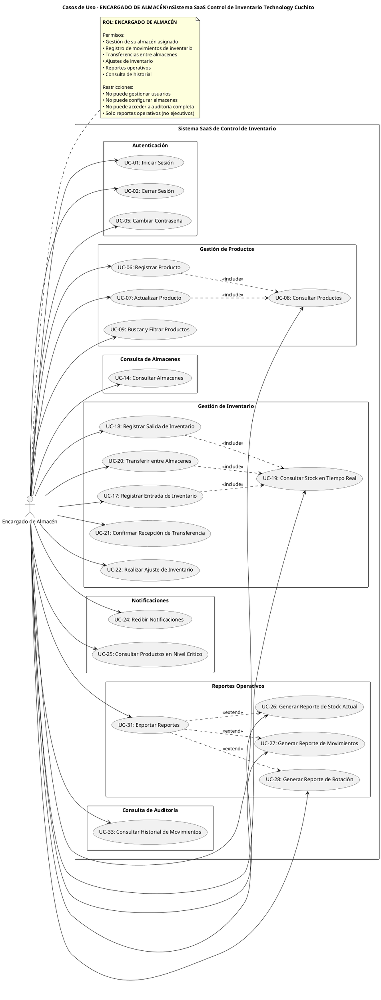

# Diagrama de Casos de Uso - ENCARGADO DE ALMACÉN
## Sistema SaaS de Control de Inventario - Technology Cuchito

---

## Diagrama UML - PlantUML

---

## ESPECIFICACIONES DE CASOS DE USO

---

### MÓDULO: AUTENTICACIÓN

#### UC-01: Iniciar Sesión

**ID del Caso de Uso:** UC-01  
**Nombre del Caso de Uso:** Iniciar Sesión  
**Actor Principal:** Encargado de Almacén  

**Descripción:**  
Permite al encargado de almacén autenticarse en el sistema para acceder a las funcionalidades operativas de su almacén asignado.

**Precondiciones:**  
- El encargado debe estar registrado en el sistema
- El encargado debe tener un almacén asignado
- El sistema debe estar operativo

**Flujo Básico:**
1. El encargado accede a la página de login
2. El sistema muestra el formulario de autenticación
3. El encargado ingresa su usuario y contraseña
4. El encargado presiona el botón "Iniciar Sesión"
5. El sistema valida las credenciales
6. El sistema verifica que tenga rol de "Encargado de Almacén"
7. El sistema carga la configuración de su almacén asignado
8. El sistema genera un token JWT con permisos de encargado
9. El sistema redirige al dashboard operativo de su almacén
10. El caso de uso finaliza

**Flujo Alternativo:**
- **FA-01 (Credenciales incorrectas):**
  - En el paso 5, si las credenciales son incorrectas:
    - El sistema muestra mensaje de error
    - Retorna al paso 2

- **FA-02 (Sin almacén asignado):**
  - En el paso 7, si no tiene almacén asignado:
    - El sistema muestra "No tiene almacén asignado. Contacte al administrador"
    - El sistema no permite acceso a funcionalidades
    - El caso de uso finaliza

- **FA-03 (Almacén desactivado):**
  - En el paso 7, si el almacén está inactivo:
    - El sistema muestra "Su almacén está desactivado"
    - El sistema permite acceso solo a consultas
    - Continúa en paso 9

**Postcondiciones:**
- El encargado queda autenticado
- El sistema carga contexto de su almacén
- El encargado tiene acceso solo a su almacén
- Se registra el inicio de sesión en auditoría

---

#### UC-02: Cerrar Sesión

**ID del Caso de Uso:** UC-02  
**Nombre del Caso de Uso:** Cerrar Sesión  
**Actor Principal:** Encargado de Almacén  

**Descripción:**  
Permite al encargado cerrar su sesión actual en el sistema de forma segura.

**Precondiciones:**  
- El encargado debe tener una sesión activa

**Flujo Básico:**
1. El encargado selecciona la opción "Cerrar Sesión"
2. El sistema verifica si hay operaciones pendientes
3. El sistema muestra mensaje de confirmación
4. El encargado confirma el cierre de sesión
5. El sistema invalida el token JWT
6. El sistema limpia los datos de sesión
7. El sistema redirige a la página de login
8. El caso de uso finaliza

**Flujo Alternativo:**
- **FA-01 (Operaciones pendientes):**
  - En el paso 2, si hay transferencias sin confirmar:
    - El sistema muestra advertencia "Tiene transferencias pendientes"
    - El encargado puede cancelar o continuar
    - Si cancela: retorna a la página actual
    - Si continúa: continúa en paso 3

- **FA-02 (Cancelar cierre):**
  - En el paso 4, si cancela:
    - El sistema mantiene la sesión activa
    - El caso de uso finaliza

**Postcondiciones:**
- La sesión queda cerrada
- El token queda invalidado
- Se registra el cierre en auditoría

---

#### UC-05: Cambiar Contraseña

**ID del Caso de Uso:** UC-05  
**Nombre del Caso de Uso:** Cambiar Contraseña  
**Actor Principal:** Encargado de Almacén  

**Descripción:**  
Permite al encargado cambiar su propia contraseña de acceso.

**Precondiciones:**  
- El encargado debe estar autenticado
- El encargado debe conocer su contraseña actual

**Flujo Básico:**
1. El encargado accede a su perfil
2. El encargado selecciona "Cambiar Contraseña"
3. El sistema muestra formulario de cambio de contraseña
4. El encargado ingresa:
   - Contraseña actual
   - Nueva contraseña
   - Confirmación de nueva contraseña
5. El encargado presiona "Guardar"
6. El sistema valida la contraseña actual
7. El sistema valida políticas de seguridad
8. El sistema encripta la nueva contraseña
9. El sistema actualiza la contraseña
10. El sistema muestra mensaje "Contraseña actualizada correctamente"
11. El caso de uso finaliza

**Flujo Alternativo:**
- **FA-01 (Contraseña actual incorrecta):**
  - En el paso 6, si es incorrecta:
    - El sistema muestra error
    - Retorna al paso 4

- **FA-02 (Contraseñas no coinciden):**
  - En el paso 7, si no coinciden:
    - El sistema muestra error
    - Retorna al paso 4

- **FA-03 (Contraseña débil):**
  - En el paso 7, si no cumple políticas:
    - El sistema muestra requisitos
    - Retorna al paso 4

**Postcondiciones:**
- La contraseña queda actualizada
- La sesión actual permanece activa
- Se registra el cambio en auditoría

---

### MÓDULO: GESTIÓN DE PRODUCTOS

#### UC-06: Registrar Producto

**ID del Caso de Uso:** UC-06  
**Nombre del Caso de Uso:** Registrar Producto  
**Actor Principal:** Encargado de Almacén  

**Descripción:**  
Permite al encargado registrar nuevos productos en el catálogo del sistema.

**Precondiciones:**  
- El encargado debe estar autenticado
- Las categorías deben estar configuradas

**Flujo Básico:**
1. El encargado accede al módulo de Productos
2. El encargado selecciona "Nuevo Producto"
3. El sistema muestra el formulario de registro
4. El encargado ingresa los datos del producto:
   - Código/SKU
   - Nombre
   - Descripción
   - Categoría
   - Marca y modelo
   - Proveedor
   - Precios
   - Stock mínimo y máximo
5. El encargado presiona "Guardar"
6. El sistema valida los datos
7. El sistema verifica que el código sea único
8. El sistema consulta si el producto existe (incluye UC-08)
9. El sistema guarda el producto
10. El sistema muestra mensaje "Producto registrado correctamente"
11. El caso de uso finaliza

**Flujo Alternativo:**
- **FA-01 (Código duplicado):**
  - En el paso 7, si el código existe:
    - El sistema muestra error
    - Retorna al paso 4

- **FA-02 (Datos incompletos):**
  - En el paso 6, si faltan datos:
    - El sistema resalta campos faltantes
    - Retorna al paso 4

**Postcondiciones:**
- El producto queda registrado
- El producto está disponible para operaciones
- Se registra en auditoría

---

#### UC-07: Actualizar Producto

**ID del Caso de Uso:** UC-07  
**Nombre del Caso de Uso:** Actualizar Producto  
**Actor Principal:** Encargado de Almacén  

**Descripción:**  
Permite al encargado modificar información de productos existentes.

**Precondiciones:**  
- El encargado debe estar autenticado
- El producto debe existir

**Flujo Básico:**
1. El encargado accede al módulo de Productos
2. El encargado busca el producto
3. El encargado selecciona el producto
4. El sistema consulta y carga datos (incluye UC-08)
5. El sistema muestra formulario con datos actuales
6. El encargado modifica los campos deseados
7. El encargado presiona "Guardar"
8. El sistema valida los datos
9. El sistema actualiza el producto
10. El sistema muestra mensaje "Producto actualizado"
11. El caso de uso finaliza

**Flujo Alternativo:**
- **FA-01 (Producto con movimientos recientes):**
  - En el paso 4, si hay movimientos del día:
    - El sistema muestra advertencia
    - El encargado confirma
    - Continúa en paso 5

**Postcondiciones:**
- El producto queda actualizado
- Los cambios se reflejan en el sistema
- Se registra la modificación

---

#### UC-08: Consultar Productos

**ID del Caso de Uso:** UC-08  
**Nombre del Caso de Uso:** Consultar Productos  
**Actor Principal:** Encargado de Almacén  

**Descripción:**  
Permite al encargado visualizar información detallada de los productos.

**Precondiciones:**  
- El encargado debe estar autenticado

**Flujo Básico:**
1. El encargado accede al módulo de Productos
2. El sistema muestra listado de productos con:
   - Código, nombre, categoría
   - Stock en su almacén
   - Stock total
   - Estado
3. El encargado selecciona un producto
4. El sistema muestra detalles:
   - Información general
   - Stock en su almacén
   - Últimos movimientos de su almacén
   - Nivel de stock
5. El caso de uso finaliza

**Flujo Alternativo:**
- **FA-01 (Sin productos):**
  - En el paso 2, si no hay productos:
    - El sistema muestra mensaje informativo
    - Ofrece registrar producto
    - El caso de uso finaliza

**Postcondiciones:**
- El encargado visualiza la información
- No se modifica ningún dato

---

#### UC-09: Buscar y Filtrar Productos

**ID del Caso de Uso:** UC-09  
**Nombre del Caso de Uso:** Buscar y Filtrar Productos  
**Actor Principal:** Encargado de Almacén  

**Descripción:**  
Permite al encargado buscar productos específicos y aplicar filtros.

**Precondiciones:**  
- El encargado debe estar autenticado

**Flujo Básico:**
1. El encargado está en el listado de productos
2. El encargado ingresa término de búsqueda
3. El sistema busca en tiempo real
4. El sistema muestra resultados
5. El encargado puede aplicar filtros:
   - Por categoría
   - Por nivel de stock en su almacén
   - Por estado
6. El sistema aplica filtros
7. El sistema muestra productos filtrados
8. El caso de uso finaliza

**Flujo Alternativo:**
- **FA-01 (Sin resultados):**
  - En el paso 4, si no hay coincidencias:
    - El sistema muestra mensaje
    - Sugiere ajustar criterios
    - El caso de uso finaliza

**Postcondiciones:**
- Se muestran productos que cumplen criterios
- Los filtros permanecen activos

---

### MÓDULO: CONSULTA DE ALMACENES

#### UC-14: Consultar Almacenes

**ID del Caso de Uso:** UC-14  
**Nombre del Caso de Uso:** Consultar Almacenes  
**Actor Principal:** Encargado de Almacén  

**Descripción:**  
Permite al encargado consultar información de almacenes del sistema (principalmente el suyo).

**Precondiciones:**  
- El encargado debe estar autenticado
- El encargado debe tener almacén asignado

**Flujo Básico:**
1. El encargado accede al módulo de Almacenes
2. El sistema muestra listado de almacenes con:
   - Su almacén asignado (destacado)
   - Otros almacenes (solo lectura)
3. El encargado selecciona un almacén para ver detalles
4. Si es su almacén asignado:
   - El sistema muestra información completa
   - Stock de productos
   - Movimientos recientes
   - Gráficos de ocupación
5. Si es otro almacén:
   - El sistema muestra información básica
   - Stock general (sin detalles)
6. El caso de uso finaliza

**Flujo Alternativo:**
- **FA-01 (Solo ver su almacén):**
  - En el paso 2, el encargado puede filtrar:
    - Ver solo su almacén asignado
    - El sistema muestra vista detallada
    - Continúa en paso 4

**Postcondiciones:**
- El encargado visualiza información de almacenes
- Se enfoca en su almacén asignado
- No se modifica ningún dato

---

### MÓDULO: GESTIÓN DE INVENTARIO

#### UC-17: Registrar Entrada de Inventario

**ID del Caso de Uso:** UC-17  
**Nombre del Caso de Uso:** Registrar Entrada de Inventario  
**Actor Principal:** Encargado de Almacén  

**Descripción:**  
Permite al encargado registrar entradas de productos a su almacén asignado.

**Precondiciones:**  
- El encargado debe estar autenticado
- El encargado debe tener almacén asignado
- El almacén debe estar activo

**Flujo Básico:**
1. El encargado accede al módulo de Movimientos
2. El encargado selecciona "Nueva Entrada"
3. El sistema muestra formulario de entrada
4. El sistema pre-selecciona su almacén asignado (no editable)
5. El encargado ingresa:
   - Tipo de entrada (Compra, Devolución, Ajuste)
   - Producto
   - Cantidad
   - Precio unitario (si aplica)
   - Proveedor (si es compra)
   - Número de documento
   - Observaciones
6. El encargado puede agregar múltiples productos
7. El encargado presiona "Guardar Entrada"
8. El sistema valida los datos
9. El sistema consulta stock actual (incluye UC-19)
10. El sistema calcula nuevo stock
11. El sistema registra el movimiento
12. El sistema actualiza stock en su almacén
13. El sistema muestra mensaje "Entrada registrada correctamente"
14. El sistema genera comprobante
15. El caso de uso finaliza

**Flujo Alternativo:**
- **FA-01 (Producto no existe):**
  - En el paso 5, si el producto no existe:
    - El encargado puede registrar nuevo producto
    - Se ejecuta UC-06
    - Retorna al paso 5

- **FA-02 (Cantidad excede capacidad):**
  - En el paso 10, si excede capacidad:
    - El sistema muestra advertencia
    - El encargado confirma o ajusta
    - Si confirma: continúa en paso 11
    - Si ajusta: retorna al paso 5

**Postcondiciones:**
- El stock aumenta en su almacén
- Se registra el movimiento
- Se actualiza valorización
- Se genera documento de entrada

---

#### UC-18: Registrar Salida de Inventario

**ID del Caso de Uso:** UC-18  
**Nombre del Caso de Uso:** Registrar Salida de Inventario  
**Actor Principal:** Encargado de Almacén  

**Descripción:**  
Permite al encargado registrar salidas de productos de su almacén.

**Precondiciones:**  
- El encargado debe estar autenticado
- El producto debe tener stock disponible en su almacén

**Flujo Básico:**
1. El encargado accede al módulo de Movimientos
2. El encargado selecciona "Nueva Salida"
3. El sistema muestra formulario de salida
4. El sistema pre-selecciona su almacén (no editable)
5. El encargado ingresa:
   - Tipo de salida (Venta, Merma, Donación)
   - Producto
   - Cantidad
   - Precio de venta (si aplica)
   - Cliente (si es venta)
   - Número de documento
   - Motivo/Observaciones
6. El sistema consulta stock disponible (incluye UC-19)
7. El sistema muestra stock actual
8. El encargado puede agregar múltiples productos
9. El encargado presiona "Guardar Salida"
10. El sistema valida disponibilidad de stock
11. El sistema calcula nuevo stock
12. El sistema registra el movimiento
13. El sistema actualiza stock en su almacén
14. Si stock < mínimo, genera alerta
15. El sistema muestra mensaje "Salida registrada correctamente"
16. El sistema genera comprobante
17. El caso de uso finaliza

**Flujo Alternativo:**
- **FA-01 (Stock insuficiente):**
  - En el paso 10, si cantidad > stock:
    - El sistema muestra "Stock insuficiente. Disponible: X"
    - El sistema muestra stock en otros almacenes
    - Ofrece ajustar cantidad o solicitar transferencia
    - Si ajusta: retorna al paso 5
    - Si solicita transferencia: se ejecuta UC-20

- **FA-02 (Stock en nivel crítico):**
  - En el paso 14, si stock < mínimo:
    - El sistema genera alerta
    - Se ejecuta UC-24 (Recibir Notificaciones)
    - Continúa en paso 15

**Postcondiciones:**
- El stock disminuye en su almacén
- Se registra el movimiento
- Se generan alertas si es necesario
- Se genera documento de salida

---

#### UC-19: Consultar Stock en Tiempo Real

**ID del Caso de Uso:** UC-19  
**Nombre del Caso de Uso:** Consultar Stock en Tiempo Real  
**Actor Principal:** Encargado de Almacén  

**Descripción:**  
Permite al encargado consultar el stock disponible en tiempo real, principalmente de su almacén.

**Precondiciones:**  
- El encargado debe estar autenticado

**Flujo Básico:**
1. El encargado accede al módulo de Inventario
2. El sistema muestra vista de stock con:
   - Productos de su almacén (vista principal)
   - Stock de cada producto
   - Estado (normal, bajo, crítico)
   - Valorización
3. El encargado puede cambiar vista:
   - Solo su almacén (predeterminado)
   - Comparar con otros almacenes
4. El sistema actualiza en tiempo real
5. El sistema muestra indicadores visuales:
   - Verde: stock normal
   - Amarillo: stock bajo
   - Rojo: stock crítico
6. El encargado puede ver detalles de un producto
7. El sistema muestra:
   - Stock actual en su almacén
   - Stock en otros almacenes (solo lectura)
   - Últimos movimientos de su almacén
   - Stock en tránsito (transferencias)
8. El caso de uso finaliza

**Flujo Alternativo:**
- **FA-01 (Producto sin stock en su almacén):**
  - Si un producto no tiene stock:
    - El sistema muestra "Sin stock"
    - El sistema muestra stock en otros almacenes
    - El sistema sugiere solicitar transferencia
    - Continúa en paso 6

- **FA-02 (Filtrar por categoría):**
  - En el paso 2, puede filtrar:
    - Por categoría
    - Por estado de stock
    - El sistema aplica filtros
    - Continúa en paso 4

**Postcondiciones:**
- El encargado visualiza stock actualizado
- Se enfoca en su almacén asignado
- No se modifica ningún dato

---

#### UC-20: Transferir entre Almacenes

**ID del Caso de Uso:** UC-20  
**Nombre del Caso de Uso:** Transferir entre Almacenes  
**Actor Principal:** Encargado de Almacén  

**Descripción:**  
Permite al encargado crear transferencias desde su almacén hacia otros almacenes.

**Precondiciones:**  
- El encargado debe estar autenticado
- El producto debe tener stock en su almacén
- Debe haber otros almacenes activos

**Flujo Básico:**
1. El encargado accede al módulo de Transferencias
2. El encargado selecciona "Nueva Transferencia"
3. El sistema muestra formulario de transferencia
4. El sistema pre-selecciona su almacén como origen (no editable)
5. El encargado selecciona:
   - Almacén destino
   - Producto a transferir
   - Cantidad
   - Motivo
   - Fecha programada
   - Responsable del traslado
6. El sistema consulta stock (incluye UC-19)
7. El sistema valida disponibilidad
8. El encargado puede agregar múltiples productos
9. El encargado presiona "Crear Transferencia"
10. El sistema genera código de transferencia
11. El sistema registra con estado "Pendiente"
12. El sistema descuenta stock de su almacén (en tránsito)
13. El sistema genera documento
14. El sistema notifica al encargado destino
15. El sistema muestra mensaje "Transferencia creada correctamente"
16. El caso de uso finaliza

**Flujo Alternativo:**
- **FA-01 (Stock insuficiente):**
  - En el paso 7, si cantidad > stock:
    - El sistema muestra "Stock insuficiente"
    - El encargado ajusta cantidad o cancela
    - Si ajusta: retorna al paso 5
    - Si cancela: el caso de uso finaliza

- **FA-02 (Transferencia urgente):**
  - En el paso 5, puede marcar urgente:
    - El sistema prioriza la transferencia
    - El sistema envía notificación inmediata
    - Continúa en paso 6

**Postcondiciones:**
- La transferencia queda registrada como "Pendiente"
- El stock de origen disminuye (en tránsito)
- Se genera documento de transferencia
- El encargado destino recibe notificación

---

#### UC-21: Confirmar Recepción de Transferencia

**ID del Caso de Uso:** UC-21  
**Nombre del Caso de Uso:** Confirmar Recepción de Transferencia  
**Actor Principal:** Encargado de Almacén  

**Descripción:**  
Permite al encargado confirmar la recepción de productos transferidos a su almacén.

**Precondiciones:**  
- El encargado debe estar autenticado
- Debe existir una transferencia pendiente hacia su almacén

**Flujo Básico:**
1. El encargado accede al módulo de Transferencias
2. El sistema muestra transferencias pendientes hacia su almacén
3. El encargado selecciona la transferencia a confirmar
4. El sistema muestra detalles:
   - Almacén origen
   - Productos y cantidades
   - Fecha de creación
   - Responsable
5. El encargado verifica productos recibidos físicamente
6. El encargado puede:
   - Confirmar cantidad completa
   - Reportar diferencias
   - Reportar productos dañados
7. El encargado ingresa observaciones (si aplica)
8. El encargado presiona "Confirmar Recepción"
9. El sistema actualiza stock en su almacén
10. El sistema actualiza estado a "Completada"
11. El sistema registra fecha y hora de recepción
12. El sistema notifica al almacén origen
13. El sistema muestra mensaje "Recepción confirmada"
14. El caso de uso finaliza

**Flujo Alternativo:**
- **FA-01 (Recepción parcial):**
  - En el paso 6, si recibe cantidad menor:
    - El encargado ingresa cantidad real recibida
    - El encargado ingresa motivo
    - El sistema actualiza con cantidad real
    - El sistema crea incidencia
    - El sistema marca como "Completada con diferencias"
    - Continúa en paso 11

- **FA-02 (Productos dañados):**
  - En el paso 6, si hay productos dañados:
    - El encargado reporta cantidad dañada
    - El sistema registra merma
    - El sistema genera reporte de incidencia
    - Continúa en paso 9

- **FA-03 (Rechazar transferencia):**
  - En el paso 8, puede rechazar:
    - El encargado ingresa motivo
    - El sistema cambia estado a "Rechazada"
    - El sistema restaura stock en origen
    - El caso de uso finaliza

**Postcondiciones:**
- El stock de su almacén aumenta
- La transferencia queda completada
- Se registra fecha y hora de recepción
- El almacén origen recibe notificación

---

#### UC-22: Realizar Ajuste de Inventario

**ID del Caso de Uso:** UC-22  
**Nombre del Caso de Uso:** Realizar Ajuste de Inventario  
**Actor Principal:** Encargado de Almacén  

**Descripción:**  
Permite al encargado realizar ajustes de inventario en su almacén para corregir diferencias.

**Precondiciones:**  
- El encargado debe estar autenticado
- Se debe haber realizado conteo físico
- Solo puede ajustar su almacén asignado

**Flujo Básico:**
1. El encargado accede al módulo de Ajustes
2. El encargado selecciona "Nuevo Ajuste"
3. El sistema muestra formulario
4. El sistema pre-selecciona su almacén (no editable)
5. El encargado selecciona:
   - Producto a ajustar
   - Tipo de ajuste (Conteo físico, Corrección, Merma)
6. El sistema muestra stock actual del sistema
7. El encargado ingresa:
   - Cantidad física real
   - Motivo detallado
   - Observaciones
   - Documento de respaldo (opcional)
8. El sistema calcula diferencia (real - sistema)
9. El sistema muestra diferencia como entrada (+) o salida (-)
10. Si diferencia > 10%, el sistema requiere justificación adicional
11. El encargado revisa y confirma
12. El encargado presiona "Aplicar Ajuste"
13. El sistema valida la información
14. El sistema genera código de ajuste
15. El sistema actualiza stock en su almacén
16. El sistema registra el movimiento
17. El sistema muestra mensaje "Ajuste aplicado correctamente"
18. El sistema genera reporte de ajuste
19. Si diferencia > 10%, notifica al administrador
20. El caso de uso finaliza

**Flujo Alternativo:**
- **FA-01 (Diferencia mayor al 10%):**
  - En el paso 10, si |diferencia| > 10%:
    - El sistema requiere justificación detallada
    - El encargado debe explicar la diferencia
    - El sistema notifica al administrador para aprobación
    - Continúa en paso 11

- **FA-02 (Ajuste múltiple - inventario completo):**
  - En el paso 2, puede seleccionar "Ajuste masivo":
    - El encargado carga archivo con conteo
    - El sistema valida formato
    - El sistema procesa todos los productos
    - El sistema genera reporte de diferencias
    - El encargado revisa y confirma
    - Continúa en paso 13

- **FA-03 (Cancelar ajuste):**
  - En cualquier paso, si cancela:
    - El sistema descarta el ajuste
    - No se afecta el stock
    - El caso de uso finaliza

**Postcondiciones:**
- El stock del sistema coincide con stock físico
- Se registra el ajuste con justificación
- Se genera reporte de ajuste
- Si diferencia es significativa, se notifica al administrador

---

### MÓDULO: NOTIFICACIONES

#### UC-24: Recibir Notificaciones

**ID del Caso de Uso:** UC-24  
**Nombre del Caso de Uso:** Recibir Notificaciones  
**Actor Principal:** Encargado de Almacén  

**Descripción:**  
Permite al encargado recibir y gestionar notificaciones relacionadas con su almacén.

**Precondiciones:**  
- El encargado debe estar autenticado
- Debe existir una condición que genere notificación

**Flujo Básico:**
1. El sistema detecta condición que genera notificación:
   - Stock bajo en su almacén
   - Transferencia entrante pendiente
   - Movimiento importante
   - Ajuste que requiere atención
2. El sistema genera notificación automática
3. El sistema muestra badge de notificación
4. El encargado accede al panel de notificaciones
5. El sistema muestra listado:
   - No leídas (destacadas)
   - Leídas
   - Fecha y hora
   - Tipo
   - Descripción
6. El encargado selecciona una notificación
7. El sistema muestra detalles:
   - Descripción completa
   - Datos relevantes (producto, stock, almacén)
   - Acciones sugeridas
   - Link al módulo relacionado
8. El encargado puede:
   - Marcar como leída
   - Ir al módulo relacionado
   - Descartar
9. El sistema actualiza estado
10. El caso de uso finaliza

**Flujo Alternativo:**
- **FA-01 (Notificación de stock crítico en su almacén):**
  - En el paso 1, si stock < mínimo:
    - El sistema genera notificación prioritaria
    - Notificación muestra stock actual
    - Ofrece link a reporte
    - Continúa en paso 3

- **FA-02 (Notificación de transferencia entrante):**
  - En el paso 1, si hay transferencia pendiente:
    - El sistema notifica al encargado
    - Notificación muestra productos en tránsito
    - Ofrece link a UC-21 (Confirmar Recepción)
    - Continúa en paso 3

- **FA-03 (Marcar todas como leídas):**
  - En el paso 5, puede marcar todas:
    - El sistema marca todas
    - El badge se actualiza
    - Continúa en paso 5

**Postcondiciones:**
- El encargado está informado de eventos importantes
- Las notificaciones quedan marcadas según acción
- Se mantiene historial

---

#### UC-25: Consultar Productos en Nivel Crítico

**ID del Caso de Uso:** UC-25  
**Nombre del Caso de Uso:** Consultar Productos en Nivel Crítico  
**Actor Principal:** Encargado de Almacén  

**Descripción:**  
Permite al encargado visualizar productos en nivel crítico de stock en su almacén.

**Precondiciones:**  
- El encargado debe estar autenticado
- El almacén debe tener productos con stock configurado

**Flujo Básico:**
1. El encargado accede al módulo de Alertas
2. El encargado selecciona "Productos en Nivel Crítico"
3. El sistema consulta productos de su almacén
4. El sistema compara stock actual vs stock mínimo
5. El sistema muestra listado de productos críticos en su almacén:
   - Producto (nombre y código)
   - Stock actual en su almacén
   - Stock mínimo
   - Categoría
   - Días estimados de stock
   - Última salida
6. El sistema ordena por criticidad
7. El sistema muestra indicadores visuales:
   - Rojo: crítico (< mínimo)
   - Naranja: bajo (< 20% sobre mínimo)
8. El encargado puede:
   - Ver detalles del producto
   - Solicitar transferencia de otro almacén
   - Ver stock en otros almacenes
9. El caso de uso finaliza

**Flujo Alternativo:**
- **FA-01 (Sin productos críticos):**
  - En el paso 5, si no hay productos críticos:
    - El sistema muestra mensaje positivo
    - Ofrece ver productos en nivel bajo
    - El caso de uso finaliza

- **FA-02 (Solicitar transferencia):**
  - En el paso 8, puede solicitar transferencia:
    - El sistema muestra almacenes con stock disponible
    - El encargado puede crear solicitud
    - El sistema notifica al encargado del almacén origen
    - El caso de uso finaliza

- **FA-03 (Generar reporte):**
  - En el paso 8, puede generar reporte:
    - Se ejecuta UC-26
    - El sistema genera reporte de críticos
    - El caso de uso finaliza

**Postcondiciones:**
- El encargado conoce productos críticos de su almacén
- Se pueden tomar acciones preventivas
- Se genera registro de consulta

---

### MÓDULO: REPORTES OPERATIVOS

#### UC-26: Generar Reporte de Stock Actual

**ID del Caso de Uso:** UC-26  
**Nombre del Caso de Uso:** Generar Reporte de Stock Actual  
**Actor Principal:** Encargado de Almacén  

**Descripción:**  
Permite al encargado generar reportes del stock actual de su almacén.

**Precondiciones:**  
- El encargado debe estar autenticado
- Su almacén debe tener productos

**Flujo Básico:**
1. El encargado accede al módulo de Reportes
2. El encargado selecciona "Reporte de Stock Actual"
3. El sistema muestra opciones de filtros:
   - Por categoría (predeterminado: todas)
   - Por estado (con stock, sin stock, crítico)
   - Fecha de corte (predeterminado: hoy)
4. El sistema pre-selecciona su almacén (no editable)
5. El encargado selecciona formato:
   - Vista en pantalla
   - PDF
   - Excel
6. El encargado presiona "Generar Reporte"
7. El sistema consulta datos de su almacén
8. El sistema genera reporte con:
   - Resumen (totales, valorización de su almacén)
   - Listado detallado por producto:
     * Código y nombre
     * Categoría
     * Stock en su almacén
     * Precio unitario
     * Valorización
     * Estado de stock
   - Gráficos de distribución
   - Fecha y hora de generación
9. El sistema muestra el reporte
10. El caso de uso finaliza

**Flujo Alternativo:**
- **FA-01 (Sin datos):**
  - En el paso 8, si no hay datos:
    - El sistema muestra mensaje
    - Sugiere ajustar filtros
    - Retorna al paso 3

- **FA-02 (Exportar reporte):**
  - En el paso 9, puede exportar:
    - Se ejecuta UC-31
    - El sistema genera archivo
    - El caso de uso finaliza

**Postcondiciones:**
- El reporte queda generado
- Refleja stock de su almacén
- Se registra en auditoría

---

#### UC-27: Generar Reporte de Movimientos

**ID del Caso de Uso:** UC-27  
**Nombre del Caso de Uso:** Generar Reporte de Movimientos  
**Actor Principal:** Encargado de Almacén  

**Descripción:**  
Permite al encargado generar reportes de movimientos de su almacén.

**Precondiciones:**  
- El encargado debe estar autenticado
- Debe haber movimientos en su almacén

**Flujo Básico:**
1. El encargado accede al módulo de Reportes
2. El encargado selecciona "Reporte de Movimientos"
3. El sistema muestra opciones:
   - Rango de fechas (obligatorio)
   - Tipo de movimiento (entrada, salida, transferencia)
   - Producto específico (opcional)
4. El sistema pre-selecciona su almacén (no editable)
5. El encargado configura filtros
6. El encargado selecciona formato
7. El encargado presiona "Generar Reporte"
8. El sistema consulta movimientos de su almacén
9. El sistema genera reporte con:
   - Resumen ejecutivo (totales por tipo)
   - Detalle de movimientos:
     * Fecha y hora
     * Tipo
     * Producto
     * Cantidad
     * Usuario que registró
     * Documento
   - Gráficos de movimientos
10. El sistema muestra el reporte
11. El caso de uso finaliza

**Flujo Alternativo:**
- **FA-01 (Sin movimientos):**
  - En el paso 9, si no hay movimientos:
    - El sistema muestra mensaje
    - Sugiere ampliar rango
    - Retorna al paso 3

**Postcondiciones:**
- El reporte de movimientos queda generado
- Refleja actividad de su almacén
- Se registra en auditoría

---

#### UC-28: Generar Reporte de Rotación

**ID del Caso de Uso:** UC-28  
**Nombre del Caso de Uso:** Generar Reporte de Rotación  
**Actor Principal:** Encargado de Almacén  

**Descripción:**  
Permite al encargado generar reportes de rotación de productos de su almacén.

**Precondiciones:**  
- El encargado debe estar autenticado
- Debe haber movimientos de salida en su almacén
- Los productos deben tener al menos 30 días de historial

**Flujo Básico:**
1. El encargado accede al módulo de Reportes
2. El encargado selecciona "Reporte de Rotación"
3. El sistema muestra opciones:
   - Período de análisis (30, 60, 90 días)
   - Categoría (todas o específica)
4. El sistema pre-selecciona su almacén (no editable)
5. El encargado configura parámetros
6. El encargado presiona "Generar Reporte"
7. El sistema calcula índice de rotación por producto en su almacén
8. El sistema clasifica productos:
   - Alta rotación
   - Media rotación
   - Baja rotación
   - Sin rotación
9. El sistema genera reporte con:
   - Resumen por clasificación
   - Listado de productos con índice
   - Gráficos
   - Productos top 10 y bottom 10 de su almacén
10. El sistema muestra el reporte
11. El caso de uso finaliza

**Flujo Alternativo:**
- **FA-01 (Período insuficiente):**
  - En el paso 7, si período < 30 días:
    - El sistema muestra advertencia
    - El encargado puede continuar o ajustar
    - Si continúa: muestra nota en reporte
    - Si ajusta: retorna al paso 3

**Postcondiciones:**
- El reporte de rotación queda generado
- Se identifican productos de alta y baja rotación en su almacén
- Se registra en auditoría

---

#### UC-31: Exportar Reportes

**ID del Caso de Uso:** UC-31  
**Nombre del Caso de Uso:** Exportar Reportes  
**Actor Principal:** Encargado de Almacén  

**Descripción:**  
Permite al encargado exportar reportes generados en diferentes formatos.

**Precondiciones:**  
- El encargado debe estar autenticado
- Debe existir un reporte generado (UC-26, UC-27 o UC-28)

**Flujo Básico:**
1. El encargado está visualizando un reporte
2. El encargado selecciona "Exportar"
3. El sistema muestra opciones de formato:
   - PDF
   - Excel
   - CSV
4. El encargado selecciona formato
5. El encargado puede configurar opciones:
   - Orientación (PDF)
   - Incluir gráficos
   - Incluir resumen
6. El encargado presiona "Exportar"
7. El sistema procesa el reporte
8. El sistema genera el archivo
9. El sistema inicia descarga
10. El sistema muestra mensaje "Reporte exportado correctamente"
11. El sistema registra la exportación
12. El caso de uso finaliza

**Flujo Alternativo:**
- **FA-01 (Exportar a PDF):**
  - En el paso 7, si formato es PDF:
    - El sistema genera PDF profesional
    - Incluye encabezado y pie de página
    - Incluye gráficos en alta calidad
    - Continúa en paso 9

- **FA-02 (Exportar a Excel):**
  - En el paso 7, si formato es Excel:
    - El sistema genera archivo .xlsx
    - Incluye múltiples hojas
    - Aplica formato a tablas
    - Continúa en paso 9

- **FA-03 (Reporte muy grande):**
  - En el paso 7, si reporte muy grande:
    - El sistema muestra barra de progreso
    - El encargado puede cancelar
    - Si completa: continúa en paso 9
    - Si cancela: retorna al paso 2

**Postcondiciones:**
- El archivo queda generado y descargado
- Se registra la exportación en auditoría
- El formato es compatible con software estándar

---

### MÓDULO: CONSULTA DE AUDITORÍA

#### UC-33: Consultar Historial de Movimientos

**ID del Caso de Uso:** UC-33  
**Nombre del Caso de Uso:** Consultar Historial de Movimientos  
**Actor Principal:** Encargado de Almacén  

**Descripción:**  
Permite al encargado consultar el historial de movimientos de su almacén para trazabilidad.

**Precondiciones:**  
- El encargado debe estar autenticado
- Debe haber movimientos en su almacén

**Flujo Básico:**
1. El encargado accede al módulo de Auditoría
2. El encargado selecciona "Historial de Movimientos"
3. El sistema muestra filtros:
   - Rango de fechas
   - Producto específico
   - Tipo de movimiento
   - Usuario que registró
4. El sistema pre-filtra por su almacén (no editable)
5. El encargado aplica filtros deseados
6. El sistema consulta movimientos de su almacén
7. El sistema muestra listado cronológico:
   - Fecha y hora
   - Tipo de movimiento
   - Producto
   - Cantidad
   - Usuario responsable
   - Documento
   - Stock resultante
8. El encargado puede seleccionar un movimiento
9. El sistema muestra detalles completos:
   - Información completa
   - Antes y después del stock
   - Documentos adjuntos
10. El caso de uso finaliza

**Flujo Alternativo:**
- **FA-01 (Rastrear producto específico):**
  - En el paso 5, si busca por producto:
    - El sistema muestra línea de tiempo del producto en su almacén
    - El sistema muestra evolución de stock
    - Continúa en paso 8

- **FA-02 (Sin resultados):**
  - En el paso 7, si no hay movimientos:
    - El sistema muestra mensaje
    - Sugiere ajustar filtros
    - Retorna al paso 3

- **FA-03 (Exportar historial):**
  - En el paso 8, puede exportar:
    - Se ejecuta UC-31
    - El caso de uso finaliza

**Postcondiciones:**
- El encargado visualiza historial de su almacén
- Se mantiene trazabilidad
- No se modifica ningún dato

---

## Resumen de Casos de Uso del Encargado de Almacén

**Total de Casos de Uso:** 20

**Distribución por Módulo:**
- Autenticación: 3 casos de uso
- Gestión de Productos: 4 casos de uso
- Consulta de Almacenes: 1 caso de uso
- Gestión de Inventario: 6 casos de uso
- Notificaciones: 2 casos de uso
- Reportes Operativos: 4 casos de uso
- Consulta de Auditoría: 1 caso de uso

**Permisos del Encargado de Almacén:**
El encargado tiene acceso a funcionalidades operativas enfocadas en su almacén asignado, incluyendo gestión de inventario, movimientos, transferencias, reportes operativos y consulta de historial. No tiene acceso a gestión de usuarios, configuración de almacenes ni auditoría completa del sistema.

**Restricciones:**
- Solo puede operar sobre su almacén asignado
- No puede gestionar usuarios ni roles
- No puede crear/modificar/eliminar almacenes
- Solo accede a reportes operativos (no ejecutivos)
- No tiene acceso al log completo de auditoría

---

**Proyecto**: Sistema SaaS de Control de Inventario  
**Cliente**: Technology Cuchito  
**Actor**: Encargado de Almacén  
**Versión**: 1.0  
**Fecha**: 2024
