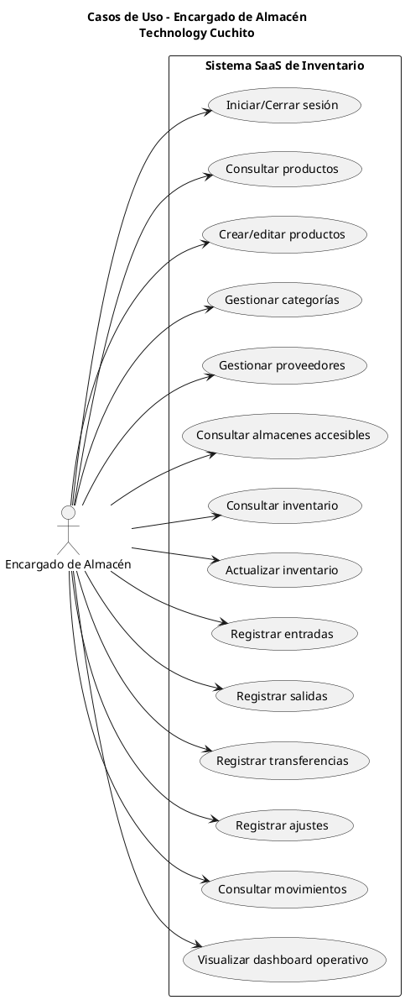

# Diagrama de Casos de Uso - Encargado de Almacén

## PlantUML

## Notas

- El acceso queda limitado por almacenes permitidos (controlado en backend).
- Después de registrar un movimiento, los paneles se refrescan en vivo sin recargar la página.
- Las acciones quedan trazadas en `auditoria`.

