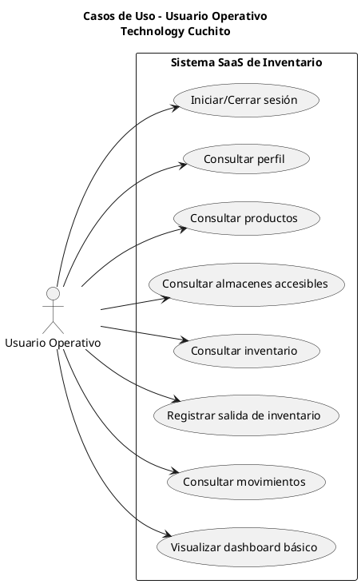

# Diagrama de Casos de Uso - Usuario Operativo

## PlantUML

## Notas

- En backend, este rol solo puede crear movimientos de tipo `salida`.
- La actualización de inventario/movimientos se refleja automáticamente en la UI.
- Todas las operaciones relevantes quedan registradas en auditoría.

