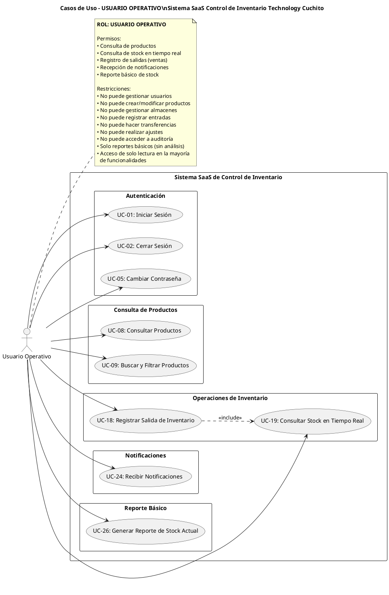

# Diagrama de Casos de Uso - USUARIO OPERATIVO
## Sistema SaaS de Control de Inventario - Technology Cuchito

---

## Diagrama UML - PlantUML

---

## ESPECIFICACIONES DE CASOS DE USO

---

### MÓDULO: AUTENTICACIÓN

#### UC-01: Iniciar Sesión

**ID del Caso de Uso:** UC-01  
**Nombre del Caso de Uso:** Iniciar Sesión  
**Actor Principal:** Usuario Operativo  

**Descripción:**  
Permite al usuario operativo autenticarse en el sistema para acceder a funcionalidades básicas de consulta y registro de ventas.

**Precondiciones:**  
- El usuario debe estar registrado en el sistema con rol "Usuario Operativo"
- El sistema debe estar operativo
- El usuario no debe tener sesión activa

**Flujo Básico:**
1. El usuario operativo accede a la página de login
2. El sistema muestra el formulario de autenticación
3. El usuario ingresa su usuario y contraseña
4. El usuario presiona el botón "Iniciar Sesión"
5. El sistema valida las credenciales
6. El sistema verifica que tenga rol de "Usuario Operativo"
7. El sistema genera un token JWT con permisos limitados
8. El sistema redirige a vista simplificada de consulta de stock
9. El caso de uso finaliza

**Flujo Alternativo:**
- **FA-01 (Credenciales incorrectas):**
  - En el paso 5, si las credenciales son incorrectas:
    - El sistema muestra mensaje "Usuario o contraseña incorrectos"
    - El sistema mantiene al usuario en la página de login
    - Retorna al paso 2

- **FA-02 (Usuario bloqueado):**
  - En el paso 5, si el usuario está bloqueado:
    - El sistema muestra "Usuario bloqueado. Contacte al administrador"
    - El sistema no permite el acceso
    - El caso de uso finaliza

- **FA-03 (Sesión ya activa):**
  - En el paso 1, si el usuario ya tiene sesión activa:
    - El sistema redirige automáticamente a la vista de stock
    - El caso de uso finaliza

- **FA-04 (Primer acceso):**
  - En el paso 8, si es primer acceso:
    - El sistema muestra breve tutorial de uso
    - El sistema explica funciones disponibles
    - El usuario puede omitir o completar
    - Continúa en paso 9

**Postcondiciones:**
- El usuario operativo queda autenticado
- Se genera un token de sesión con permisos limitados
- Se registra el inicio de sesión en el log de auditoría
- El usuario tiene acceso solo a funcionalidades de consulta y registro de ventas
- El usuario NO tiene acceso a gestión, configuración ni reportes avanzados

---

#### UC-02: Cerrar Sesión

**ID del Caso de Uso:** UC-02  
**Nombre del Caso de Uso:** Cerrar Sesión  
**Actor Principal:** Usuario Operativo  

**Descripción:**  
Permite al usuario operativo cerrar su sesión actual en el sistema de forma segura.

**Precondiciones:**  
- El usuario operativo debe tener una sesión activa
- El usuario debe estar autenticado

**Flujo Básico:**
1. El usuario operativo selecciona la opción "Cerrar Sesión"
2. El sistema verifica si hay operaciones en proceso (salidas sin confirmar)
3. El sistema muestra mensaje de confirmación
4. El usuario confirma el cierre de sesión
5. El sistema invalida el token JWT
6. El sistema limpia los datos de sesión local
7. El sistema redirige a la página de login
8. El caso de uso finaliza

**Flujo Alternativo:**
- **FA-01 (Salida en proceso):**
  - En el paso 2, si hay una salida sin guardar:
    - El sistema muestra advertencia "Tiene una salida sin guardar"
    - El sistema ofrece opciones: guardar, descartar o cancelar
    - Si guarda: guarda la salida y continúa en paso 3
    - Si descarta: descarta datos y continúa en paso 3
    - Si cancela: mantiene sesión activa y el caso finaliza

- **FA-02 (Cancelar cierre de sesión):**
  - En el paso 4, si el usuario cancela:
    - El sistema mantiene la sesión activa
    - El sistema permanece en la página actual
    - El caso de uso finaliza

- **FA-03 (Sesión expirada):**
  - Si la sesión ya expiró:
    - El sistema redirige automáticamente al login
    - El sistema muestra mensaje "Su sesión ha expirado"
    - El caso de uso finaliza

**Postcondiciones:**
- La sesión del usuario operativo queda cerrada
- El token de autenticación queda invalidado
- Se registra el cierre de sesión en el log de auditoría
- Cualquier dato temporal en memoria se descarta
- El usuario debe autenticarse nuevamente para acceder

---

#### UC-05: Cambiar Contraseña

**ID del Caso de Uso:** UC-05  
**Nombre del Caso de Uso:** Cambiar Contraseña  
**Actor Principal:** Usuario Operativo  

**Descripción:**  
Permite al usuario operativo cambiar su propia contraseña de acceso al sistema.

**Precondiciones:**  
- El usuario operativo debe estar autenticado
- El usuario debe conocer su contraseña actual

**Flujo Básico:**
1. El usuario operativo accede a su perfil
2. El usuario selecciona "Cambiar Contraseña"
3. El sistema muestra formulario simplificado de cambio de contraseña
4. El usuario ingresa:
   - Contraseña actual
   - Nueva contraseña
   - Confirmación de nueva contraseña
5. El usuario presiona "Guardar"
6. El sistema valida la contraseña actual
7. El sistema valida que la nueva contraseña cumpla políticas de seguridad:
   - Mínimo 8 caracteres
   - Al menos una mayúscula
   - Al menos una minúscula
   - Al menos un número
8. El sistema valida que las contraseñas nuevas coincidan
9. El sistema encripta la nueva contraseña con bcrypt
10. El sistema actualiza la contraseña en la base de datos
11. El sistema muestra mensaje "Contraseña actualizada correctamente"
12. El sistema mantiene la sesión activa
13. El caso de uso finaliza

**Flujo Alternativo:**
- **FA-01 (Contraseña actual incorrecta):**
  - En el paso 6, si la contraseña actual es incorrecta:
    - El sistema muestra "La contraseña actual es incorrecta"
    - El sistema resalta el campo
    - Retorna al paso 4

- **FA-02 (Contraseñas nuevas no coinciden):**
  - En el paso 8, si las contraseñas no coinciden:
    - El sistema muestra "Las contraseñas no coinciden"
    - El sistema resalta los campos de nueva contraseña
    - Retorna al paso 4

- **FA-03 (Contraseña débil):**
  - En el paso 7, si la contraseña no cumple políticas:
    - El sistema muestra mensaje detallado:
      "La contraseña debe tener:
      • Mínimo 8 caracteres
      • Al menos una letra mayúscula
      • Al menos una letra minúscula
      • Al menos un número"
    - El sistema resalta el campo
    - Retorna al paso 4

- **FA-04 (Contraseña igual a la anterior):**
  - En el paso 7, si nueva contraseña = contraseña actual:
    - El sistema muestra "La nueva contraseña debe ser diferente a la actual"
    - Retorna al paso 4

- **FA-05 (Cancelar cambio):**
  - En cualquier paso, si el usuario cancela:
    - El sistema descarta los cambios
    - El sistema cierra el formulario
    - La contraseña actual permanece sin cambios
    - El caso de uso finaliza

**Postcondiciones:**
- La contraseña del usuario operativo queda actualizada
- La contraseña queda encriptada en la base de datos
- Se registra el cambio de contraseña en el log de auditoría
- La sesión actual permanece activa (no se requiere nuevo login)
- El usuario puede seguir operando normalmente

---

### MÓDULO: CONSULTA DE PRODUCTOS

#### UC-08: Consultar Productos

**ID del Caso de Uso:** UC-08  
**Nombre del Caso de Uso:** Consultar Productos  
**Actor Principal:** Usuario Operativo  

**Descripción:**  
Permite al usuario operativo visualizar información básica de los productos registrados en el sistema para consultas rápidas.

**Precondiciones:**  
- El usuario operativo debe estar autenticado
- Debe haber productos registrados en el sistema

**Flujo Básico:**
1. El usuario operativo accede al módulo de Productos
2. El sistema muestra listado simplificado de productos con información básica:
   - Código SKU
   - Nombre del producto
   - Categoría
   - Stock total disponible
   - Precio de venta
   - Estado (disponible/agotado)
3. El listado está paginado (20 productos por página)
4. El usuario puede seleccionar un producto para ver más detalles
5. El sistema muestra vista de solo lectura con:
   - Información general del producto
   - Descripción
   - Marca y modelo
   - Stock total en todos los almacenes
   - Precio de venta
   - Categoría
   - Imagen (si está disponible)
6. El usuario NO puede modificar ningún dato (solo lectura)
7. El caso de uso finaliza

**Flujo Alternativo:**
- **FA-01 (Sin productos registrados):**
  - En el paso 2, si no hay productos:
    - El sistema muestra mensaje "No hay productos registrados en el sistema"
    - El sistema muestra imagen informativa
    - El usuario NO tiene opción de registrar (sin permisos)
    - El caso de uso finaliza

- **FA-02 (Producto agotado):**
  - En el paso 5, si el producto no tiene stock:
    - El sistema muestra badge "AGOTADO" en rojo
    - El sistema indica que no está disponible para venta
    - El sistema muestra cuándo hubo stock por última vez
    - Continúa mostrando información en modo lectura

- **FA-03 (Ver imagen del producto):**
  - En el paso 5, si el producto tiene imagen:
    - El usuario puede hacer clic en la imagen
    - El sistema muestra imagen ampliada en modal
    - El usuario puede cerrar el modal
    - Continúa en paso 5

- **FA-04 (Navegar entre productos):**
  - En el paso 5, el usuario puede:
    - Navegar al producto siguiente/anterior
    - El sistema carga datos del producto seleccionado
    - Continúa mostrando vista de solo lectura

**Postcondiciones:**
- El usuario operativo visualiza la información del producto
- No se modifica ningún dato (acceso de solo lectura)
- Se registra la consulta en el log de actividad del sistema
- El stock mostrado es en tiempo real

---

#### UC-09: Buscar y Filtrar Productos

**ID del Caso de Uso:** UC-09  
**Nombre del Caso de Uso:** Buscar y Filtrar Productos  
**Actor Principal:** Usuario Operativo  

**Descripción:**  
Permite al usuario operativo buscar productos específicos y aplicar filtros básicos para localizar rápidamente productos para consulta o venta.

**Precondiciones:**  
- El usuario operativo debe estar autenticado
- El usuario debe estar en el módulo de Productos

**Flujo Básico:**
1. El usuario operativo está en el listado de productos
2. El usuario ingresa término de búsqueda en el campo de búsqueda
3. El sistema busca en tiempo real (mientras escribe) en:
   - Código SKU
   - Nombre del producto
   - Marca
   - Modelo
4. El sistema muestra resultados que coinciden con el término
5. El usuario puede aplicar filtros básicos:
   - Por categoría (desplegable)
   - Por disponibilidad (con stock / sin stock)
   - Por rango de precio
6. El sistema aplica los filtros seleccionados
7. El sistema muestra productos filtrados
8. El sistema indica cantidad de resultados encontrados
9. Los resultados se ordenan por relevancia
10. El caso de uso finaliza

**Flujo Alternativo:**
- **FA-01 (Sin resultados de búsqueda):**
  - En el paso 4 o 7, si no hay coincidencias:
    - El sistema muestra "No se encontraron productos que coincidan con su búsqueda"
    - El sistema sugiere:
      * Verificar la ortografía
      * Usar términos más generales
      * Limpiar filtros aplicados
    - El sistema ofrece botón "Limpiar búsqueda"
    - El caso de uso finaliza

- **FA-02 (Limpiar búsqueda y filtros):**
  - En cualquier paso, si el usuario limpia búsqueda:
    - El sistema remueve el término de búsqueda
    - El sistema remueve todos los filtros aplicados
    - El sistema muestra listado completo de productos
    - Retorna al paso 2

- **FA-03 (Búsqueda por código exacto):**
  - En el paso 3, si el usuario ingresa un código SKU completo:
    - El sistema reconoce formato de código
    - El sistema busca coincidencia exacta prioritariamente
    - Si encuentra: muestra el producto específico primero
    - Si no encuentra: muestra mensaje "Código no encontrado"
    - Continúa en paso 4

- **FA-04 (Filtrar solo productos disponibles):**
  - En el paso 5, si selecciona filtro "Solo con stock":
    - El sistema oculta productos agotados
    - El sistema muestra solo productos disponibles para venta
    - El sistema indica cuántos productos fueron filtrados
    - Continúa en paso 7

- **FA-05 (Seleccionar producto para venta):**
  - En el paso 7, si el usuario selecciona un producto:
    - El usuario puede ver detalles (UC-08)
    - El usuario puede agregarlo directamente a una salida/venta
    - Se puede ejecutar UC-18 (Registrar Salida)
    - El caso de uso finaliza

- **FA-06 (Guardar búsqueda frecuente):**
  - En el paso 8, el sistema puede sugerir:
    - Guardar combinación de filtros usada frecuentemente
    - El usuario puede aceptar o rechazar
    - Si acepta: se guarda preferencia de filtros
    - Los filtros guardados aparecen como accesos rápidos
    - Continúa en paso 10

**Postcondiciones:**
- Se muestran los productos que cumplen los criterios de búsqueda
- Los filtros permanecen activos durante la sesión
- Se registra la búsqueda en analytics del sistema (para mejorar sugerencias)
- El usuario puede seleccionar productos para operaciones de venta

---

### MÓDULO: OPERACIONES DE INVENTARIO

#### UC-18: Registrar Salida de Inventario

**ID del Caso de Uso:** UC-18  
**Nombre del Caso de Uso:** Registrar Salida de Inventario  
**Actor Principal:** Usuario Operativo  

**Descripción:**  
Permite al usuario operativo registrar salidas de productos del inventario, principalmente para ventas a clientes.

**Precondiciones:**  
- El usuario operativo debe estar autenticado
- El producto debe existir en el sistema
- El producto debe tener stock disponible en almacén
- El almacén debe estar activo

**Flujo Básico:**
1. El usuario operativo accede al módulo de Ventas/Salidas
2. El usuario selecciona "Nueva Venta" o "Registrar Salida"
3. El sistema muestra formulario simplificado de salida
4. El sistema pre-selecciona almacén por defecto (según configuración del usuario)
5. El usuario busca y selecciona el producto:
   - Puede buscar por código SKU
   - Puede buscar por nombre
   - Puede usar escáner de código de barras (si disponible)
6. El sistema consulta stock disponible en tiempo real (incluye UC-19)
7. El sistema muestra:
   - Nombre del producto
   - Stock actual disponible
   - Precio de venta
   - Imagen del producto (si existe)
8. El usuario ingresa:
   - Cantidad a vender (obligatorio)
   - Tipo de comprobante: Boleta o Factura (obligatorio)
   - Cliente (opcional para boleta, obligatorio para factura)
   - Número de comprobante (obligatorio)
   - Método de pago: Efectivo, Tarjeta, Transferencia (obligatorio)
   - Observaciones (opcional)
9. El usuario puede agregar más productos repitiendo pasos 5-8
10. El sistema muestra resumen de la venta:
    - Lista de productos
    - Cantidades
    - Precios unitarios
    - Subtotales
    - Total de la venta
11. El usuario revisa el resumen
12. El usuario presiona "Registrar Venta" o "Guardar Salida"
13. El sistema valida que haya stock suficiente para todos los productos
14. El sistema valida que todos los campos obligatorios estén completos
15. El sistema genera código único de movimiento/venta
16. El sistema registra el movimiento de salida en la base de datos
17. El sistema actualiza el stock de cada producto en el almacén
18. El sistema actualiza valorización de inventario
19. Si algún producto queda con stock < stock mínimo, el sistema genera alerta
20. El sistema muestra mensaje "Venta registrada correctamente"
21. El sistema genera comprobante de salida (puede ser impreso)
22. El sistema muestra opción de iniciar nueva venta o ver detalles
23. El caso de uso finaliza

**Flujo Alternativo:**
- **FA-01 (Stock insuficiente):**
  - En el paso 13, si cantidad solicitada > stock disponible:
    - El sistema muestra mensaje de error:
      "Stock insuficiente para [Producto]. Disponible: X unidades"
    - El sistema resalta el producto con error
    - El sistema muestra stock actual
    - El usuario puede:
      * Ajustar la cantidad a stock disponible
      * Eliminar el producto de la venta
      * Cancelar la venta completa
    - Si ajusta: retorna al paso 9
    - Si elimina producto: retorna al paso 10
    - Si cancela: el caso de uso finaliza sin cambios

- **FA-02 (Producto no disponible):**
  - En el paso 5, si el producto está inactivo:
    - El sistema muestra mensaje "Producto no disponible para venta"
    - El sistema no permite seleccionarlo
    - El usuario debe buscar otro producto
    - Retorna al paso 5

- **FA-03 (Campos obligatorios incompletos):**
  - En el paso 14, si faltan campos obligatorios:
    - El sistema muestra mensaje "Complete todos los campos obligatorios"
    - El sistema resalta campos faltantes en rojo
    - El sistema no permite continuar
    - Retorna al paso 8

- **FA-04 (Descuento o precio especial):**
  - En el paso 8, si se requiere aplicar descuento:
    - El usuario operativo NO tiene permisos para modificar precios
    - El sistema muestra precio estándar del sistema
    - El usuario debe solicitar autorización a encargado/administrador
    - Para continuar con precio estándar: continúa en paso 9
    - Para aplicar descuento: requiere intervención de encargado

- **FA-05 (Cliente frecuente - Factura):**
  - En el paso 8, si selecciona Factura:
    - El sistema requiere datos del cliente obligatoriamente:
      * RUC (obligatorio)
      * Razón Social (obligatorio)
      * Dirección (obligatorio)
    - El usuario puede buscar cliente en base de datos
    - El usuario puede ingresar datos manualmente
    - Continúa en paso 9

- **FA-06 (Cancelar venta/salida):**
  - En cualquier paso antes del 16, si el usuario cancela:
    - El sistema muestra confirmación "¿Desea cancelar la venta?"
    - Si confirma:
      * El sistema descarta todos los datos ingresados
      * No se registra ningún movimiento
      * No se afecta el stock
      * El caso de uso finaliza
    - Si no confirma: retorna al paso actual

- **FA-07 (Error al registrar):**
  - En el paso 16, si hay error en la base de datos:
    - El sistema muestra "Error al registrar la venta. Intente nuevamente"
    - El sistema mantiene los datos ingresados
    - El sistema sugiere verificar conexión
    - El usuario puede reintentar o cancelar
    - Si reintenta: retorna al paso 13
    - Si cancela: el caso de uso finaliza sin cambios

- **FA-08 (Imprimir comprobante):**
  - En el paso 21, el usuario puede:
    - Imprimir comprobante directamente
    - Enviar comprobante por email (si cliente proporcionó)
    - Descargar en PDF
    - El sistema genera documento según opción
    - Continúa en paso 22

- **FA-09 (Stock alcanza nivel crítico):**
  - En el paso 19, si stock < stock mínimo:
    - El sistema genera alerta automática
    - Se ejecuta UC-24 (Recibir Notificaciones)
    - El sistema notifica al encargado del almacén
    - El sistema muestra advertencia al usuario:
      "Atención: El producto [X] ha alcanzado nivel bajo de stock"
    - Continúa en paso 20

- **FA-10 (Venta rápida - Un solo producto):**
  - En el paso 9, si solo vende un producto:
    - El usuario puede saltar al paso 12 directamente
    - No es necesario agregar más productos
    - El sistema muestra resumen simple
    - Continúa en paso 11

**Postcondiciones:**
- El stock del producto disminuye en el almacén especificado
- Se registra el movimiento de salida en la base de datos
- Se actualiza la valorización del inventario
- Se genera documento de venta/comprobante
- Si el stock queda bajo el mínimo, se generan alertas automáticas
- Se registra la operación en el log de auditoría
- El encargado del almacén puede ver el movimiento en su historial
- El stock actualizado es visible en tiempo real para todos los usuarios

---

#### UC-19: Consultar Stock en Tiempo Real

**ID del Caso de Uso:** UC-19  
**Nombre del Caso de Uso:** Consultar Stock en Tiempo Real  
**Actor Principal:** Usuario Operativo  

**Descripción:**  
Permite al usuario operativo consultar el stock disponible de productos en tiempo real para verificar disponibilidad antes de realizar ventas.

**Precondiciones:**  
- El usuario operativo debe estar autenticado
- Debe haber productos registrados en el sistema

**Flujo Básico:**
1. El usuario operativo accede al módulo de Stock o Inventario
2. El sistema muestra vista simplificada de stock en tiempo real con:
   - Listado de productos paginado
   - Para cada producto:
     * Código SKU
     * Nombre del producto
     * Categoría
     * Stock total disponible
     * Estado visual (disponible/bajo/agotado)
3. Los productos se muestran ordenados por nombre (predeterminado)
4. El sistema actualiza la información en tiempo real
5. El sistema muestra indicadores visuales de estado:
   - **Verde (Disponible):** Stock > stock mínimo
   - **Amarillo (Bajo):** Stock ≤ stock mínimo pero > 0
   - **Rojo (Agotado):** Stock = 0
6. El usuario puede seleccionar un producto para ver más detalles
7. El sistema muestra vista detallada de solo lectura con:
   - Stock actual total
   - Stock por almacén (si hay múltiples almacenes)
   - Últimas 5 ventas/salidas del producto
   - Nivel de stock (crítico, bajo, normal)
   - Stock mínimo configurado
   - Stock en tránsito (si hay transferencias pendientes)
8. El usuario NO puede modificar ningún dato (solo consulta)
9. El caso de uso finaliza

**Flujo Alternativo:**
- **FA-01 (Buscar producto específico):**
  - En el paso 2, el usuario puede buscar:
    - Ingresa código SKU o nombre en campo de búsqueda
    - El sistema filtra resultados en tiempo real
    - El sistema muestra solo productos que coinciden
    - Si encuentra uno: puede ver detalles directamente
    - Si encuentra varios: muestra listado filtrado
    - Continúa en paso 6

- **FA-02 (Filtrar por disponibilidad):**
  - En el paso 2, el usuario puede filtrar:
    - Selecciona filtro: "Solo disponibles", "Todos" o "Agotados"
    - El sistema aplica filtro
    - El sistema muestra productos según criterio
    - Continúa en paso 5

- **FA-03 (Filtrar por categoría):**
  - En el paso 2, puede filtrar por categoría:
    - Selecciona categoría del desplegable
    - El sistema muestra solo productos de esa categoría
    - El sistema indica cantidad de productos en la categoría
    - Continúa en paso 5

- **FA-04 (Producto sin stock):**
  - En el paso 7, si el producto tiene stock 0:
    - El sistema muestra badge "AGOTADO" en rojo
    - El sistema muestra mensaje "Este producto no está disponible"
    - El sistema indica cuándo se vendió la última unidad
    - El sistema muestra stock en otros almacenes (si los hay)
    - El usuario NO puede realizar venta de este producto
    - Continúa en paso 8

- **FA-05 (Ver stock por almacén):**
  - En el paso 7, si hay múltiples almacenes:
    - El sistema muestra desglose de stock por almacén:
      * Almacén Principal: X unidades
      * Almacén Secundario: Y unidades
      * Punto de Venta A: Z unidades
    - El sistema indica cuál es el almacén predeterminado para ventas
    - Continúa en paso 8

- **FA-06 (Stock en tránsito):**
  - En el paso 7, si hay transferencias pendientes:
    - El sistema muestra información:
      "Stock en tránsito: X unidades (pendiente de recepción)"
    - El sistema indica origen y destino de la transferencia
    - El sistema indica fecha estimada de llegada
    - Este stock NO está disponible para venta aún
    - Continúa en paso 8

- **FA-07 (Actualizar stock en tiempo real):**
  - Durante la visualización (cualquier paso):
    - Si otro usuario registra una venta/entrada
    - El sistema actualiza automáticamente el stock mostrado
    - El sistema puede mostrar notificación breve: "Stock actualizado"
    - Los números se actualizan sin necesidad de recargar
    - Continúa en el paso actual

- **FA-08 (Producto en nivel crítico):**
  - En el paso 7, si stock ≤ stock mínimo:
    - El sistema muestra alerta visual destacada
    - El sistema muestra mensaje:
      "⚠️ Stock bajo: Solo quedan X unidades"
    - El sistema sugiere notificar al encargado
    - El usuario puede tomar nota para informar
    - Continúa en paso 8

- **FA-09 (Ver histórico de movimientos):**
  - En el paso 7, el usuario puede ver:
    - Últimas 5 salidas/ventas del producto
    - Fecha y hora de cada movimiento
    - Cantidad vendida
    - Usuario que registró
    - Stock resultante después de cada venta
    - El usuario NO tiene acceso al historial completo (solo los últimos)
    - Continúa en paso 8

- **FA-10 (Iniciar venta desde consulta):**
  - En el paso 7, el usuario puede:
    - Si el producto tiene stock disponible
    - El sistema muestra botón "Vender este producto"
    - El usuario hace clic
    - Se ejecuta UC-18 (Registrar Salida) con producto pre-seleccionado
    - El caso de uso finaliza

**Postcondiciones:**
- El usuario operativo visualiza el stock actualizado en tiempo real
- No se modifica ningún dato del sistema (solo consulta)
- Se registra la consulta en el log de actividad (para analytics)
- El usuario puede tomar decisiones informadas sobre disponibilidad
- El stock mostrado es el mismo que verá al realizar una venta

---

### MÓDULO: NOTIFICACIONES

#### UC-24: Recibir Notificaciones

**ID del Caso de Uso:** UC-24  
**Nombre del Caso de Uso:** Recibir Notificaciones  
**Actor Principal:** Usuario Operativo  

**Descripción:**  
Permite al usuario operativo recibir y visualizar notificaciones básicas del sistema relacionadas con stock y operaciones.

**Precondiciones:**  
- El usuario operativo debe estar autenticado
- El sistema de notificaciones debe estar habilitado
- Debe existir una condición que genere una notificación para el usuario

**Flujo Básico:**
1. El sistema detecta una condición que genera notificación relevante para usuarios operativos:
   - Producto alcanzó stock crítico durante una venta
   - Producto se agotó
   - Información importante del sistema
   - Actualización de precios
2. El sistema genera notificación automática
3. El sistema muestra badge numérico en el ícono de notificaciones (campana)
4. El badge indica cantidad de notificaciones no leídas
5. El usuario operativo hace clic en el ícono de notificaciones
6. El sistema muestra panel de notificaciones con:
   - **Notificaciones no leídas** (resaltadas, al inicio)
   - **Notificaciones leídas** (atenuadas)
   - Para cada notificación:
     * Ícono del tipo de notificación
     * Título breve
     * Descripción corta
     * Fecha y hora (ej: "Hace 5 minutos", "Hoy 10:30 AM")
7. Las notificaciones están ordenadas por fecha (más recientes primero)
8. El usuario puede seleccionar una notificación para ver más detalles
9. El sistema muestra detalles completos de la notificación:
   - Título completo
   - Descripción detallada
   - Datos relevantes (ej: producto, stock actual)
   - Fecha y hora exacta
   - Acciones sugeridas (si aplica)
10. El sistema marca automáticamente la notificación como leída
11. El badge se actualiza (disminuye el contador)
12. El caso de uso finaliza

**Flujo Alternativo:**
- **FA-01 (Notificación de stock crítico):**
  - En el paso 1, si un producto alcanzó nivel crítico:
    - El sistema genera notificación prioritaria (resaltada en amarillo/naranja)
    - La notificación muestra:
      * "⚠️ Stock bajo: [Nombre del Producto]"
      * "Solo quedan X unidades disponibles"
      * Fecha y hora
    - El usuario puede hacer clic para ver detalles
    - En detalles, el sistema ofrece:
      * Ver stock completo del producto (ejecuta UC-19)
      * Ver historial de ventas recientes
    - Continúa en paso 3

- **FA-02 (Notificación de producto agotado):**
  - En el paso 1, si un producto se agotó completamente:
    - El sistema genera notificación importante (resaltada en rojo)
    - La notificación muestra:
      * "❌ Producto agotado: [Nombre del Producto]"
      * "No hay stock disponible para venta"
    - El usuario puede marcarla como leída
    - El sistema sugiere verificar stock en la consulta
    - Continúa en paso 3

- **FA-03 (Sin notificaciones):**
  - En el paso 6, si no hay notificaciones:
    - El sistema muestra mensaje:
      "No tiene notificaciones nuevas"
    - El sistema muestra ícono ilustrativo
    - El panel queda vacío pero funcional
    - El caso de uso finaliza

- **FA-04 (Marcar todas como leídas):**
  - En el paso 6, el usuario puede:
    - Hacer clic en "Marcar todas como leídas"
    - El sistema marca todas las notificaciones no leídas
    - El badge desaparece (contador = 0)
    - Las notificaciones pasan a estado "leído"
    - Continúa en paso 6

- **FA-05 (Eliminar notificación):**
  - En el paso 8 o 9, el usuario puede:
    - Hacer clic en ícono de "eliminar" (papelera)
    - El sistema solicita confirmación: "¿Eliminar esta notificación?"
    - Si confirma:
      * El sistema elimina la notificación
      * La notificación desaparece del listado
      * El badge se actualiza si era no leída
    - Si cancela: continúa en paso 8

- **FA-06 (Notificación con acción directa):**
  - En el paso 9, si la notificación tiene acción asociada:
    - El sistema muestra botón de acción, por ejemplo:
      * "Ver stock del producto" → ejecuta UC-19
      * "Ver detalles" → ejecuta UC-08
    - El usuario puede hacer clic en la acción
    - El sistema ejecuta el caso de uso correspondiente
    - La notificación se marca como leída
    - El caso de uso finaliza

- **FA-07 (Filtrar notificaciones):**
  - En el paso 6, el usuario puede filtrar:
    - Selecciona filtro: "Todas", "No leídas", "Leídas"
    - El sistema aplica filtro
    - El sistema muestra solo notificaciones del tipo seleccionado
    - Continúa en paso 8

- **FA-08 (Notificación del sistema):**
  - En el paso 1, si es notificación informativa general:
    - El sistema genera notificación de información (ícono azul)
    - Ejemplos:
      * "Actualización de precios realizada"
      * "El sistema estará en mantenimiento el [fecha]"
      * "Nuevos productos agregados al catálogo"
    - El usuario puede marcarla como leída
    - Continúa en paso 3

- **FA-09 (Notificaciones en tiempo real):**
  - Durante cualquier paso:
    - Si se genera una nueva notificación mientras el panel está abierto
    - El sistema la agrega automáticamente al inicio del listado
    - El badge se actualiza en tiempo real
    - El sistema puede mostrar animación breve de "nueva notificación"
    - No interrumpe la navegación del usuario
    - Continúa en el paso actual

**Postcondiciones:**
- El usuario operativo está informado de eventos importantes
- Las notificaciones quedan marcadas como leídas según interacción
- Se mantiene historial de notificaciones (últimos 30 días)
- El badge de notificaciones se actualiza correctamente
- Las notificaciones críticas quedan resaltadas para atención prioritaria
- El usuario puede tomar acciones informadas basándose en las notificaciones

---

### MÓDULO: REPORTE BÁSICO

#### UC-26: Generar Reporte de Stock Actual

**ID del Caso de Uso:** UC-26  
**Nombre del Caso de Uso:** Generar Reporte de Stock Actual  
**Actor Principal:** Usuario Operativo  

**Descripción:**  
Permite al usuario operativo generar un reporte básico y simplificado del stock actual de productos para consulta rápida.

**Precondiciones:**  
- El usuario operativo debe estar autenticado
- Debe haber productos registrados en el sistema con stock

**Flujo Básico:**
1. El usuario operativo accede al módulo de Reportes
2. El sistema muestra solo opción disponible: "Reporte de Stock Actual"
3. El usuario selecciona "Reporte de Stock Actual"
4. El sistema muestra formulario simplificado con opciones limitadas:
   - **Filtros disponibles:**
     * Por categoría (desplegable con todas las categorías)
     * Por estado de stock: Todos / Solo disponibles / Solo agotados
   - **Fecha de corte:** Fecha actual (no editable para usuario operativo)
   - **Formato de salida:**
     * Vista en pantalla (predeterminado)
     * PDF para imprimir
     * Excel básico
5. El usuario selecciona los filtros deseados (opcional)
6. El usuario selecciona formato de salida
7. El usuario presiona botón "Generar Reporte"
8. El sistema consulta los datos de stock según filtros aplicados
9. El sistema procesa la información
10. El sistema genera reporte simplificado con:
    
    **Resumen básico:**
    - Total de productos listados
    - Total de productos con stock
    - Total de productos agotados
    - Fecha y hora de generación
    
    **Listado de productos:**
    - Código SKU
    - Nombre del producto
    - Categoría
    - Stock actual total
    - Estado (Disponible/Bajo/Agotado)
    
    **Nota:** NO incluye información sensible como:
    - Precios de compra
    - Valorización
    - Márgenes de ganancia
    - Costos
    
11. El sistema muestra el reporte en pantalla
12. Si el formato seleccionado fue PDF o Excel:
    - El sistema genera el archivo
    - El sistema inicia descarga automática
13. El caso de uso finaliza

**Flujo Alternativo:**
- **FA-01 (Sin datos para el reporte):**
  - En el paso 9, si no hay productos que cumplan los filtros:
    - El sistema muestra mensaje:
      "No hay productos que coincidan con los filtros seleccionados"
    - El sistema sugiere:
      * Cambiar los filtros aplicados
      * Seleccionar "Todos" en estado de stock
      * Seleccionar "Todas" en categorías
    - El sistema ofrece botón "Ajustar filtros"
    - Retorna al paso 4

- **FA-02 (Generar reporte en PDF):**
  - En el paso 12, si seleccionó formato PDF:
    - El sistema genera archivo PDF con formato simple y limpio
    - El PDF incluye:
      * Encabezado: "Reporte de Stock Actual"
      * Fecha y hora de generación
      * Filtros aplicados
      * Tabla con listado de productos
      * Resumen al final
    - El PDF está optimizado para impresión en A4
    - El sistema descarga archivo: "reporte_stock_[fecha].pdf"
    - El usuario puede abrirlo e imprimirlo
    - El caso de uso finaliza

- **FA-03 (Generar reporte en Excel):**
  - En el paso 12, si seleccionó formato Excel:
    - El sistema genera archivo Excel (.xlsx) básico
    - El archivo incluye:
      * Una sola hoja con los datos
      * Encabezados en negrita
      * Datos en tabla simple
      * Sin fórmulas complejas
    - El sistema descarga archivo: "reporte_stock_[fecha].xlsx"
    - El usuario puede abrirlo para consulta o manipulación
    - El caso de uso finaliza

- **FA-04 (Filtrar solo productos disponibles):**
  - En el paso 5, si selecciona "Solo disponibles":
    - El sistema excluye productos con stock = 0
    - El reporte muestra solo productos que se pueden vender
    - El resumen indica cuántos productos fueron excluidos
    - Continúa en paso 7

- **FA-05 (Filtrar por categoría específica):**
  - En el paso 5, si selecciona una categoría:
    - El sistema filtra solo productos de esa categoría
    - El título del reporte indica la categoría seleccionada
    - El resumen es específico para esa categoría
    - Continúa en paso 7

- **FA-06 (Ver solo productos agotados):**
  - En el paso 5, si selecciona "Solo agotados":
    - El sistema muestra solo productos con stock = 0
    - Útil para identificar qué productos no se pueden vender
    - El reporte resalta todos los productos en rojo
    - Continúa en paso 7

- **FA-07 (Cancelar generación):**
  - En el paso 7, si el usuario cancela:
    - El sistema no genera ningún reporte
    - El sistema retorna al menú principal
    - No se registra ninguna acción
    - El caso de uso finaliza

- **FA-08 (Error al generar archivo):**
  - En el paso 12, si hay error al generar PDF o Excel:
    - El sistema muestra mensaje de error:
      "Error al generar el archivo. Por favor, intente nuevamente"
    - El sistema sugiere:
      * Verificar que no haya archivos abiertos con el mismo nombre
      * Reintentar la generación
      * Intentar con vista en pantalla
    - El usuario puede reintentar o cancelar
    - Si reintenta: retorna al paso 8
    - Si cancela: el caso de uso finaliza

- **FA-09 (Reporte muy grande):**
  - En el paso 9, si hay más de 500 productos:
    - El sistema muestra advertencia:
      "El reporte contiene muchos productos y puede tardar en generarse"
    - El sistema muestra barra de progreso durante generación
    - El usuario puede esperar o cancelar
    - Si espera: continúa en paso 10
    - Si cancela: el caso de uso finaliza

- **FA-10 (Imprimir directamente):**
  - En el paso 11, si el reporte está en pantalla:
    - El usuario puede usar botón "Imprimir"
    - El sistema abre diálogo de impresión del navegador
    - El usuario configura impresora y opciones
    - El sistema imprime el reporte
    - Continúa en paso 13

**Postcondiciones:**
- El reporte básico de stock queda generado
- Se registra la generación en el log del sistema (para auditoría)
- El usuario tiene información actualizada del stock
- Si se descargó archivo, está disponible en carpeta de descargas
- El reporte refleja el estado actual al momento de la generación
- NO se expone información sensible (precios de compra, valorizaciones, etc.)
- El reporte es de solo lectura (el usuario no puede modificar datos del sistema)

---

## Resumen de Casos de Uso del Usuario Operativo

**Total de Casos de Uso:** 7

**Distribución por Módulo:**
- Autenticación: 3 casos de uso
- Consulta de Productos: 2 casos de uso
- Operaciones de Inventario: 2 casos de uso (1 consulta, 1 operación)
- Notificaciones: 1 caso de uso
- Reporte Básico: 1 caso de uso (versión simplificada)

**Permisos del Usuario Operativo:**
El usuario operativo tiene acceso limitado y enfocado en operaciones básicas de consulta y ventas:
- ✅ Consultar productos y stock
- ✅ Buscar y filtrar productos
- ✅ Registrar salidas/ventas de inventario
- ✅ Consultar stock en tiempo real
- ✅ Recibir notificaciones básicas
- ✅ Generar reporte simple de stock
- ✅ Cambiar su propia contraseña

**Restricciones del Usuario Operativo:**
El usuario operativo NO tiene acceso a:
- ❌ Gestión de usuarios y roles
- ❌ Crear o modificar productos
- ❌ Gestión de almacenes
- ❌ Configuración del sistema
- ❌ Registrar entradas de inventario
- ❌ Realizar transferencias entre almacenes
- ❌ Realizar ajustes de inventario
- ❌ Configurar alertas de stock
- ❌ Acceder a reportes avanzados (rotación, valorización, análisis)
- ❌ Acceder al dashboard ejecutivo
- ❌ Consultar log de auditoría completo
- ❌ Exportar datos sensibles
- ❌ Modificar precios de productos
- ❌ Ver información financiera (costos, márgenes, valorización)

**Filosofía del Rol:**
El Usuario Operativo está diseñado para personal de punto de venta o atención al cliente que necesita:
1. **Verificar disponibilidad** de productos rápidamente
2. **Registrar ventas** de manera sencilla y eficiente
3. **Consultar stock** para informar a clientes
4. **Recibir alertas** básicas sobre productos agotados
5. **Generar reportes simples** para consulta diaria

Es un rol de **solo lectura** en su mayoría, con la única capacidad de **escritura** siendo el registro de salidas/ventas, que es su función principal.

---

**Proyecto**: Sistema SaaS de Control de Inventario  
**Cliente**: Technology Cuchito  
**Actor**: Usuario Operativo  
**Versión**: 1.0  
**Fecha**: 2024
