# Diagrama de Componentes - Sistema SaaS de Inventario Technology Cuchito

## Descripción

Este diagrama de componentes muestra la arquitectura técnica del sistema SaaS de control de inventario, incluyendo las tres capas principales: Frontend (React + TypeScript), Backend (Node.js), y Base de Datos (PostgreSQL), junto con sus componentes internos y las relaciones entre ellos.

## Diagrama UML - PlantUML

```plantuml
@startuml diagrama-componentes-saas-inventario

!define RECTANGLE_COLOR #E3F2FD
!define COMPONENT_COLOR #BBDEFB
!define DATABASE_COLOR #C8E6C9
!define API_COLOR #FFF9C4

title Diagrama de Componentes - Sistema SaaS Inventario Technology Cuchito

skinparam componentStyle rectangle
skinparam {
    BackgroundColor White
    ArrowColor #424242
    BorderColor #757575
    ComponentBackgroundColor COMPONENT_COLOR
    ComponentBorderColor #1976D2
    PackageBackgroundColor RECTANGLE_COLOR
    PackageBorderColor #1976D2
    DatabaseBackgroundColor DATABASE_COLOR
    DatabaseBorderColor #388E3C
}

' ============================================
' CAPA DE PRESENTACIÓN (FRONTEND)
' ============================================
package "Frontend - React + TypeScript" as Frontend {
    
    package "Core Application" as CoreApp {
        component "Router\n(React Router)" as Router
        component "State Management\n(Context API)" as StateManager
        component "Auth Guard" as AuthGuard
        component "API Client\n(Axios)" as ApiClient
    }
    
    package "UI Components Library" as UILib {
        component "Common Components" as CommonUI
        component "Charts\n(Recharts)" as Charts
        component "Forms\n(React Hook Form)" as Forms
        component "Icons\n(Lucide React)" as Icons
        component "Notifications\n(Sonner)" as Toast
    }
    
    package "Feature Modules" as Features {
        component "Dashboard Module" as DashboardModule
        component "Productos Module" as ProductosModule
        component "Categorías Module" as CategoriasModule
        component "Proveedores Module" as ProveedoresModule
        component "Almacenes Module" as AlmacenesModule
        component "Movimientos Module" as MovimientosModule
        component "Reportes Module" as ReportesModule
        component "Usuarios Module" as UsuariosModule
        component "Configuración Module" as ConfigModule
    }
    
    package "Authentication" as AuthFrontend {
        component "Login Component" as Login
        component "Auth Context" as AuthContext
        component "Role Validator" as RoleValidator
    }
}

' ============================================
' CAPA DE APLICACIÓN (BACKEND)
' ============================================
package "Backend - Node.js + Express" as Backend {
    
    package "API Layer" as APILayer {
        component "API Gateway" as APIGateway
        component "Routes Handler" as Routes
        component "Middleware Chain" as Middleware
    }
    
    package "Authentication & Security" as AuthBackend {
        component "JWT Service" as JWTService
        component "Auth Middleware" as AuthMiddleware
        component "Role Middleware" as RoleMiddleware
        component "Password Encryption\n(bcrypt)" as PasswordService
    }
    
    package "Business Logic Layer" as BusinessLogic {
        component "Productos Service" as ProductosService
        component "Categorías Service" as CategoriasService
        component "Proveedores Service" as ProveedoresService
        component "Almacenes Service" as AlmacenesService
        component "Movimientos Service" as MovimientosService
        component "Stock Service" as StockService
        component "Reportes Service" as ReportesService
        component "Usuarios Service" as UsuariosService
        component "Analytics Service" as AnalyticsService
    }
    
    package "Data Access Layer" as DataAccess {
        component "Database Repository" as DBRepository
        component "Query Builder" as QueryBuilder
        component "Transaction Manager" as TransactionMgr
        component "Connection Pool" as ConnectionPool
    }
    
    package "External Services" as ExternalServices {
        component "Email Service" as EmailService
        component "File Storage" as FileStorage
        component "PDF Generator" as PDFGenerator
        component "Excel Generator" as ExcelGenerator
    }
}

' ============================================
' CAPA DE DATOS (DATABASE)
' ============================================
package "Database - PostgreSQL" as Database {
    
    database "PostgreSQL Server" as PostgreSQL {
        
        package "Core Tables" as CoreTables {
            component [usuarios] as TblUsuarios
            component [roles] as TblRoles
            component [permisos] as TblPermisos
        }
        
        package "Inventory Tables" as InventoryTables {
            component [productos] as TblProductos
            component [categorias] as TblCategorias
            component [proveedores] as TblProveedores
            component [almacenes] as TblAlmacenes
            component [stock] as TblStock
            component [movimientos] as TblMovimientos
        }
        
        package "Audit & Logs" as AuditTables {
            component [audit_log] as TblAuditLog
            component [activity_log] as TblActivityLog
        }
        
        package "Database Features" as DBFeatures {
            component "Stored Procedures" as StoredProcs
            component "Views" as Views
            component "Triggers" as Triggers
            component "Indexes" as Indexes
        }
    }
}

' ============================================
' INFRAESTRUCTURA Y SERVICIOS EXTERNOS
' ============================================
package "Infrastructure & External" as Infrastructure {
    component "NGINX\n(Reverse Proxy)" as NGINX
    component "Redis Cache" as Redis
    component "File System Storage" as FileSystem
    component "SMTP Server" as SMTP
}

' ============================================
' RELACIONES - FRONTEND
' ============================================
Router --> AuthGuard
Router --> Features
AuthGuard --> AuthContext
AuthContext --> ApiClient

DashboardModule --> Charts
DashboardModule --> CommonUI
ProductosModule --> Forms
ProductosModule --> CommonUI
CategoriasModule --> Forms
ProveedoresModule --> Forms
AlmacenesModule --> Forms
MovimientosModule --> Forms
UsuariosModule --> Forms
ReportesModule --> Charts
ConfigModule --> Forms

Features --> ApiClient
Features --> StateManager
Forms --> Icons
CommonUI --> Icons
Login --> AuthContext

' ============================================
' RELACIONES - FRONTEND TO BACKEND
' ============================================
ApiClient --> NGINX : "HTTPS Requests"
NGINX --> APIGateway : "Forward Requests"

' ============================================
' RELACIONES - BACKEND INTERNAL
' ============================================
APIGateway --> Routes
Routes --> Middleware
Middleware --> AuthMiddleware
AuthMiddleware --> JWTService
AuthMiddleware --> RoleMiddleware

Routes --> BusinessLogic

ProductosService --> DBRepository
CategoriasService --> DBRepository
ProveedoresService --> DBRepository
AlmacenesService --> DBRepository
MovimientosService --> DBRepository
StockService --> DBRepository
ReportesService --> DBRepository
UsuariosService --> DBRepository
UsuariosService --> PasswordService
AnalyticsService --> DBRepository

ReportesService --> PDFGenerator
ReportesService --> ExcelGenerator
UsuariosService --> EmailService
FileStorage --> FileSystem

DBRepository --> QueryBuilder
DBRepository --> TransactionMgr
DBRepository --> ConnectionPool

' ============================================
' RELACIONES - BACKEND TO DATABASE
' ============================================
ConnectionPool --> PostgreSQL : "SQL Queries"

DBRepository ..> TblUsuarios
DBRepository ..> TblRoles
DBRepository ..> TblPermisos
DBRepository ..> TblProductos
DBRepository ..> TblCategorias
DBRepository ..> TblProveedores
DBRepository ..> TblAlmacenes
DBRepository ..> TblStock
DBRepository ..> TblMovimientos
DBRepository ..> TblAuditLog
DBRepository ..> TblActivityLog

' ============================================
' RELACIONES - INFRASTRUCTURE
' ============================================
StateManager ..> Redis : "Cache Data"
APIGateway ..> Redis : "Session Cache"
EmailService --> SMTP : "Send Emails"

' ============================================
' NOTAS EXPLICATIVAS
' ============================================
note right of Frontend
  **Tecnologías Frontend:**
  - React 18+ con TypeScript
  - React Router para navegación
  - Context API para estado global
  - Recharts para gráficos
  - React Hook Form para formularios
  - Tailwind CSS para estilos
  - Axios para llamadas HTTP
end note

note right of Backend
  **Tecnologías Backend:**
  - Node.js con Express
  - JWT para autenticación
  - bcrypt para encriptación
  - PostgreSQL Client (pg)
  - Nodemailer para emails
  - PDFKit/ExcelJS para reportes
end note

note right of PostgreSQL
  **Base de Datos:**
  - PostgreSQL 14+
  - Relaciones con integridad referencial
  - Índices para optimización
  - Triggers para auditoría automática
  - Stored procedures para lógica compleja
  - Views para reportes
end note

note bottom of Infrastructure
  **Infraestructura:**
  - NGINX: Servidor web y reverse proxy
  - Redis: Cache de sesiones y datos
  - File System: Almacenamiento de archivos
  - SMTP: Servicio de correo electrónico
end note

legend right
  |= Color |= Significado |
  | <back:#E3F2FD>   </back> | Package/Contenedor |
  | <back:#BBDEFB>   </back> | Componente de Aplicación |
  | <back:#C8E6C9>   </back> | Base de Datos |
  | <back:#FFF9C4>   </back> | Servicio Externo |
  
  **Roles del Sistema:**
  • Administrador (acceso completo)
  • Encargado de Almacén (gestión operativa)
  • Usuario Operativo (consultas y operaciones básicas)
endlegend

@enduml
```

## Componentes Principales

### Frontend (React + TypeScript)

#### Core Application
- **Router**: Manejo de rutas y navegación con React Router
- **State Management**: Gestión de estado global con Context API
- **Auth Guard**: Protección de rutas según roles y autenticación
- **API Client**: Cliente HTTP configurado con Axios

#### UI Components Library
- **Common Components**: Componentes reutilizables (botones, inputs, modales, tablas)
- **Charts**: Gráficos interactivos con Recharts
- **Forms**: Formularios validados con React Hook Form
- **Icons**: Sistema de iconos con Lucide React
- **Notifications**: Sistema de notificaciones con Sonner

#### Feature Modules (9 módulos)
1. **Dashboard Module**: Panel de control ejecutivo con KPIs y gráficos
2. **Productos Module**: Gestión completa de productos
3. **Categorías Module**: Administración de categorías
4. **Proveedores Module**: Gestión de proveedores
5. **Almacenes Module**: Control de múltiples almacenes
6. **Movimientos Module**: Registro de entradas/salidas
7. **Reportes Module**: Generación de reportes e informes
8. **Usuarios Module**: Administración de usuarios y roles
9. **Configuración Module**: Configuraciones del sistema

#### Authentication
- **Login Component**: Interfaz de inicio de sesión
- **Auth Context**: Contexto de autenticación
- **Role Validator**: Validación de permisos por rol

### Backend (Node.js + Express)

#### API Layer
- **API Gateway**: Punto de entrada único para todas las peticiones
- **Routes Handler**: Definición y manejo de rutas REST
- **Middleware Chain**: Cadena de middlewares (CORS, body-parser, etc.)

#### Authentication & Security
- **JWT Service**: Generación y validación de tokens JWT
- **Auth Middleware**: Verificación de autenticación
- **Role Middleware**: Verificación de permisos por rol
- **Password Service**: Encriptación de contraseñas con bcrypt

#### Business Logic Layer
- **Productos Service**: Lógica de negocio de productos
- **Categorías Service**: Gestión de categorías
- **Proveedores Service**: Gestión de proveedores
- **Almacenes Service**: Control de almacenes
- **Movimientos Service**: Gestión de movimientos de inventario
- **Stock Service**: Cálculo y control de stock
- **Reportes Service**: Generación de reportes y analytics
- **Usuarios Service**: Gestión de usuarios y autenticación
- **Analytics Service**: Análisis y métricas del negocio

#### Data Access Layer
- **Database Repository**: Patrón repositorio para acceso a datos
- **Query Builder**: Constructor de consultas SQL
- **Transaction Manager**: Manejo de transacciones
- **Connection Pool**: Pool de conexiones a PostgreSQL

#### External Services
- **Email Service**: Envío de correos electrónicos
- **File Storage**: Gestión de archivos
- **PDF Generator**: Generación de reportes PDF
- **Excel Generator**: Exportación a Excel

### Database (PostgreSQL)

#### Core Tables
- **usuarios**: Usuarios del sistema
- **roles**: Roles de usuario (Admin, Encargado, Operativo)
- **permisos**: Permisos asignados a roles

#### Inventory Tables
- **productos**: Catálogo de productos tecnológicos
- **categorias**: Categorización de productos
- **proveedores**: Proveedores de productos
- **almacenes**: Almacenes físicos
- **stock**: Stock actual por producto y almacén
- **movimientos**: Historial de entradas/salidas

#### Audit & Logs
- **audit_log**: Registro de auditoría del sistema
- **activity_log**: Registro de actividades de usuarios

#### Database Features
- **Stored Procedures**: Procedimientos almacenados para lógica compleja
- **Views**: Vistas para reportes y consultas frecuentes
- **Triggers**: Disparadores para auditoría automática
- **Indexes**: Índices para optimización de consultas

### Infrastructure

- **NGINX**: Servidor web y reverse proxy para el frontend y API
- **Redis Cache**: Cache de sesiones y datos frecuentes
- **File System Storage**: Almacenamiento de archivos (imágenes, documentos)
- **SMTP Server**: Servidor de correo para notificaciones

## Flujo de Datos

1. **Usuario → Frontend**: El usuario interactúa con la interfaz React
2. **Frontend → API Client**: Los componentes realizan peticiones HTTP
3. **API Client → NGINX**: Las peticiones pasan por el reverse proxy
4. **NGINX → API Gateway**: Se enrutan al backend Node.js
5. **API Gateway → Middleware**: Validación de autenticación y roles
6. **Middleware → Business Logic**: Se ejecuta la lógica de negocio
7. **Business Logic → Data Access**: Se accede a los datos
8. **Data Access → PostgreSQL**: Consultas y transacciones en la BD
9. **PostgreSQL → Backend**: Retorno de datos
10. **Backend → Frontend**: Respuesta JSON al cliente
11. **Frontend → Usuario**: Actualización de la interfaz

## Seguridad

- **Autenticación**: JWT (JSON Web Tokens)
- **Autorización**: Middleware de roles (RBAC)
- **Encriptación**: bcrypt para contraseñas
- **HTTPS**: Comunicación segura
- **CORS**: Control de acceso entre dominios
- **SQL Injection**: Prevención con consultas parametrizadas
- **XSS**: Sanitización de inputs en frontend y backend

## Escalabilidad

- **Cache**: Redis para reducir carga en base de datos
- **Connection Pool**: Pool de conexiones optimizado
- **Índices**: Optimización de consultas frecuentes
- **Paginación**: En listados grandes de datos
- **Lazy Loading**: Carga perezosa de componentes
- **Code Splitting**: División de código en el frontend

## Tecnologías Utilizadas

### Frontend
- React 18+ con TypeScript
- React Router para navegación
- Context API para estado global
- Recharts para visualización de datos
- React Hook Form para formularios
- Tailwind CSS para estilos
- Axios para peticiones HTTP
- Lucide React para iconos
- Sonner para notificaciones

### Backend
- Node.js con Express
- JWT para autenticación
- bcrypt para seguridad
- pg (node-postgres) para PostgreSQL
- Nodemailer para correos
- PDFKit para generación de PDFs
- ExcelJS para exportación Excel

### Base de Datos
- PostgreSQL 14+

### Infraestructura
- NGINX como reverse proxy
- Redis para cache
- Sistema de archivos para storage
- SMTP para correo electrónico

## Notas de Implementación

1. **Separación de Responsabilidades**: Arquitectura en 3 capas bien definidas
2. **Patrón Repository**: Abstracción del acceso a datos
3. **Middleware Chain**: Procesamiento secuencial de peticiones
4. **Servicios Reutilizables**: Lógica de negocio modular
5. **Componentes Modulares**: Frontend organizado por features
6. **Validación en Capas**: Frontend y backend validan datos
7. **Manejo de Errores**: Captura y reporte de errores en todas las capas
8. **Logging**: Registro de actividades y auditoría
9. **Testing**: Preparado para pruebas unitarias e integración
10. **Documentación**: API documentada con Swagger/OpenAPI

---

**Proyecto**: Sistema SaaS de Control de Inventario  
**Cliente**: Technology Cuchito  
**Ubicación**: Perú  
**Versión**: 1.0  
**Fecha**: 2026
