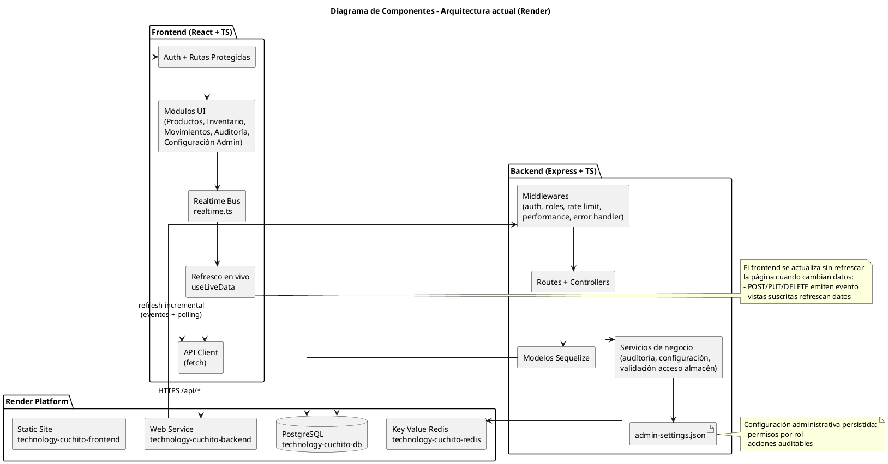

# Diagrama de Componentes - Technology Cuchito

## Estado actual
Diagrama actualizado según la implementación real del repositorio:

- Frontend React + Vite (sitio estático en Render)
- Backend Express + TypeScript (servicio web en Render)
- PostgreSQL (datos operativos)
- Redis Key Value (cache distribuido)
- `admin-settings.json` (configuración de permisos y acciones auditables)
- Sincronización en vivo en frontend (`realtime.ts` + `useLiveData`)

## Diagrama UML (PlantUML)

## Componentes clave

1. `frontend/src/app/services/api.ts`: cliente centralizado para todos los módulos.
2. `frontend/src/app/services/realtime.ts`: bus de eventos local + `storage`.
3. `frontend/src/app/hooks/useLiveData.ts`: refresco reactivo + polling.
4. `backend/src/routes/*`: endpoints REST protegidos por rol.
5. `backend/src/services/configuracionService.ts`: catálogo/permisos auditables persistidos.
6. `backend/src/config/redis.ts`: cache distribuido para rendimiento y escalabilidad.

